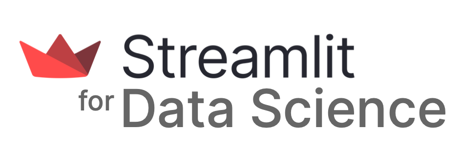

# Streamlit for Data Science

<p align="center">
  
</p>

## About
> This *Streamlit for Data Science* course will show you how to use Streamlit to prepare and analyze data as well as embed data visualizations and machine learning models right inside the Streamlit app. The best part of is that you can use various input and output widgets to make the app interactive and data-driven! Finally you can deploy the Streamlit app to the cloud and share with the community.

## Table of contents
- [**Lesson 1** - Getting up to speed with Streamlit](./content/lesson-1.md)
- [**Lesson 2** - Getting up to speed with Data Science](./content/lesson-2.md)
- [**Lesson 3** - Numerical processing with NumPy](./content/lesson-3.md)
- [**Lesson 4** - Data wrangling with Pandas](./content/lesson-4.md)
- [**Lesson 5** - 📓 Lesson 5 - Exploratory Data Analysis with Pandas](./content/lesson-5.md)
- 
## Resources
- [Streamlit Documentation](https://docs.streamlit.io/) - Your go-to place on using the Streamlit library.
- [Streamlit Cheat Sheet](https://docs.streamlit.io/library/cheatsheet) - All Streamlit commands on one-page.
- [#30DaysOfStreamlit](https://30days.streamlit.app/) - A Streamlit learning challenge.
- [Streamlit Gallery](https://streamlit.io/gallery) - A collection of community apps for inspiring your own projects
- [Streamlit Forum](https://discuss.streamlit.io/) - Get unstuck and help others in using Streamlit.

## Citing us
Please use the following to cite this content:
```
@misc{st4ds,
    author = {Chanin Nantasenamat},
    title = {Streamlit for Data Science},
    howpublished = {Streamlit Open Source, Snowflake Inc.},
    url = {\url{https://education.streamlit.app/}},
    year = {2023}
}
```
