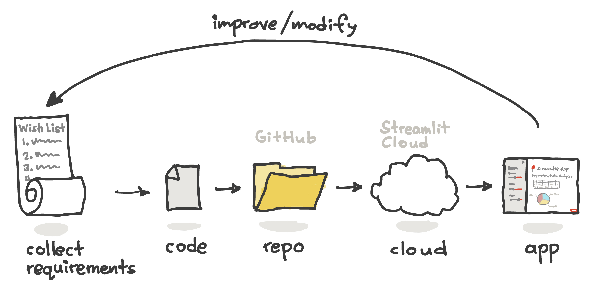
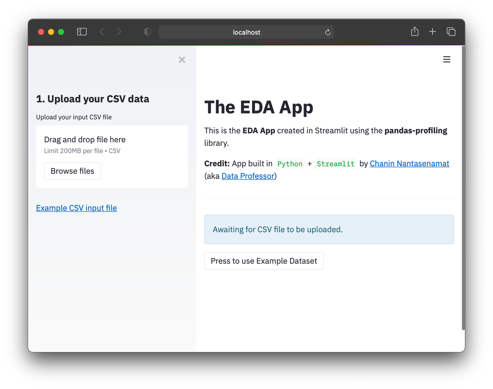

# 📓 Lesson 1 - Getting up to speed with Streamlit

## Table of Contents
1. [What is Streamlit?](#1-what-is-streamlit)
2. [Prerequisites](#2-prerequisites)
3. [Installing Streamlit](#3-installing-streamlit)
4. [Setting up your Streamlit workspace](#4-setting-up-your-streamlit-workspace)
5. [Creating your first Streamlit app](#5-creating-your-first-streamlit-app)

## 1. What is Streamlit?

Streamlit is a Python library that you can use to build interactive data-driven web apps.

A typical workflow for the creation and deployment of Streamlit app is summarized below:

<p align="center">
   
</p>

## 2. Prerequisites

Here's what you need to use Streamlit:
- Have basic Python knowledge.
- Write scripts to perform specific tasks (like taking several Excel files as input and combining them into one).
- Build and grow the Streamlit app line by line instead of starting with a predefined layout (it takes only a few lines of code).
If you can do all this, congratulations! You're ready to plunge into the world of Streamlit.

## 3. Installing Streamlit

If you already have an existing Python coding environment, Streamlit can be installed using `pip` as shown below:

```
pip install streamlit
```

## 4. Setting up your Streamlit workspace

It is typically good practice to house the Streamlit app in their own dedicated conda environment. This way the library dependencies don’t get entangled with other Python libraries used by other apps.

Here, we're going to replicate a Streamlit app from an existing GitHub repo available at https://github.com/dataprofessor/eda-app/.

Particularly, we're going to clone the EDA app from a YouTube tutorial video on [*How to Build an EDA app using Pandas Profiling*](https://youtu.be/p4uohebPuCg).

**Step 1.** Create a conda environment

Create a conda environment called eda:

```
conda create -n eda python=3.7.9
```

**Step 2.** Activate the eda environment:

```
conda activate eda
```

**Step 3.** To install prerequisite libraries we must first download the requirements.txt file (it contains the library version numbers):

```
wget https://raw.githubusercontent.com/dataprofessor/eda-app/main/requirements.txt
```

**Step 4.** To actually install prerequisite libraries using the requirements.txt file

```
pip install -r requirements.txt
```

Inside the `requirements.txt` file you'll see the following contents:

```
streamlit==0.71.0
pandas==1.1.3
numpy==1.19.2
pandas-profiling==2.10.0
streamlit-pandas-profiling==0.1.1
Jinja2==3.0.3
```

You'll notice that in the above contents, we're using legacy versions of the Python libraries, which is to be expected as this is from a tutorial from 2 years ago. In spite of this, the app should still work as the specific dependent Python libraries are specified in the `requirements.txt` file.

**Step 5.** Download and unzip contents from the GitHub repo: https://github.com/dataprofessor/eda-app/archive/main.zip

**Step 6.** Launch the app:

```
streamlit run app.py
```

You’ll see the web app browser pop up:

<p align="center">
  
</p>

The functionality of this EDA app leverages the capabilities of pandas-profiling. Let's take a look at the app in action:

<p align="center">
   
</p>

Congratulations! You now know how to clone a Streamlit app from a GitHub repo, setup a dedicated conda environment, and successfully launch the app!

## 5. Creating your first Streamlit app

Before we get into the nuts and bolts of the Streamlit library, let's take a hands-on approach for learning how to use Streamlit. Particularly, creating a simple **Hello world app** would probably be an expected rite of passage to learning Streamlit!

It's not as difficult as you may think. In fact, it takes only 2 lines of code to do just that!

```Python
import streamlit as st
st.write('Hello world!')
```

Click on the **See code explanation** toggle button to reveal the explanatory text:

<details>
<summary>See code explanation</summary>

Here's a line-by-line breakdown of the code:
  1. Import the `streamlit` library as `st` (so that we can later refer to `streamlit` literally as `st` instead of having to type the full word `streamlit`.
  2. Use `st.write` to write a text output and inside the `st.write` command we use the `'Hello world!'` string as the input argument.
</details>

## Summary

In this lesson, we're introduced to Streamlit along with how to setup a computing environment as well as creating our first Streamlit app.


