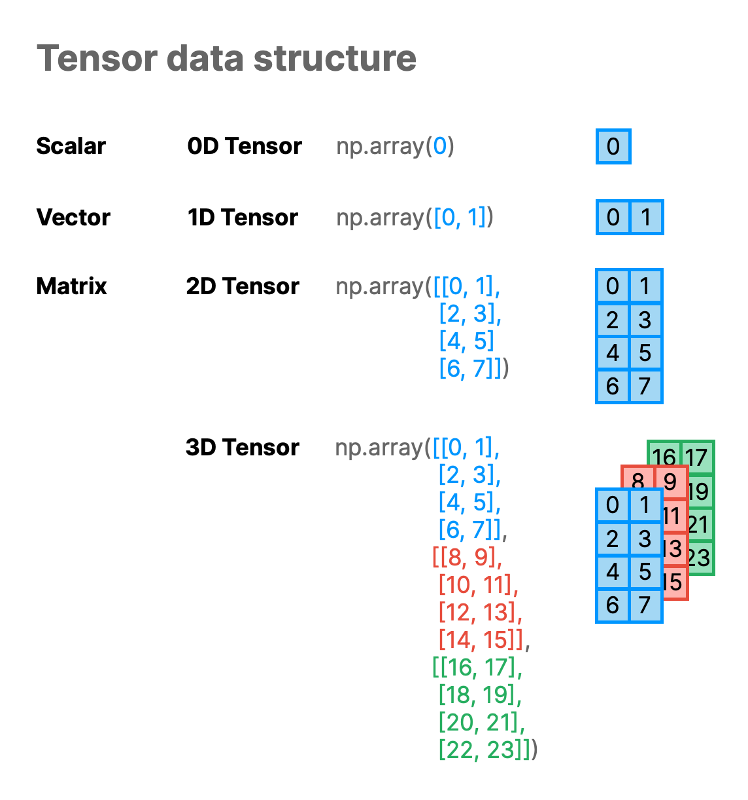

# 📓 Lesson 3 - Numerical processing with NumPy

NumPy is a Python library that allows you to perform numerical processing. 

Here are some of the following features that NumPy can do:
- Supports N-dimensional array and matrix data structures
- Perform various mathematical operations on arrays and matrices
- Transposing and reshaping matrices
- Random number generation
- etc.

## Installing NumPy

Let's start by installing NumPy that can be performed as follows:

```
pip install numpy
```

## Importing NumPy

To start using Numpy, we can import NumPy as follows:
```Python
import numpy as np
```

## Data structures in NumPy

Let's consider a simple use case of NumPy for creating data structure known as tensors. 

Before proceeding further, let's consider the following characteristics of tensors:
- It can be thought of as a container of data that can be numerical or character. 
- It can be used to represent high-dimensional data and complex relationships between variables.
- It can be of various dimensionality (e.g. 0D, 1D, 2D and 3D).

Particularly, we'll use the `np.array()` method to create scalar, vector, matrix and a 3D tensor:
```Python
# Create a scalar (0D Tensor)
x1 = np.array(0)

# Create a vector (1D Tensor)
x2 = np.array([0, 1, 2])

# Create a matrix (2D Tensor)
x3 = np.array([0, 1, 2], [3, 4, 5], [6, 7, 8])

# Create a 3D Tensor
x4 = np.array([[[ 0,  1,  2],[ 3,  4,  5],[ 6,  7,  8]],
               [[ 9, 10, 11],[12, 13, 14],[15, 16, 17]],
               [[18, 19, 20],[21, 22, 23],[24, 25, 26]]])
```

<p align="center">
  
</p>

As summarized above, a vector is an array of scalar, a matrix is an array of vectors and the 3D tensor is an array of matrix.

Now that we have taken a quick glance at NumPy, let's proceed to seeing how we can handle and process data.

## Array manipulation

Previously, we've created a 1-dimensional array (vector) and often times we may need to manipulate arrays to different form in order to suit different data science tasks.

Reshaping arrays will allow us to make changes to the dimensions or data structure of arrays. Particularly, let's say that if we would like to reshape a 1D array into a 2D array, we can use the `reshape()` method that takes a tuple of the new dimension as an input argument.

### Creating a 1D array

```Python
import numpy as np
x3 = np.array([0, 1, 2, 3, 4, 5, 6, 7, 8])
```

### Determining the data type

To determine the data type of the `x3` variable that we've just created we can use the `type()` function.
```Python
type(x3)
```
This returns the following:
```
numpy.ndarray
```
which indicates the NumPy array data type.

### Reshaping 1D to 2D array

We're now going to reshape the 1D array to a 2D array using the `reshape()` method as follows:
```Python
x3.reshape((3, 3))
```
This will display the 3 by 3 data matrix (2D array) as follows:
```
np.array([[0, 1, 2],
          [3, 4, 5],
          [6, 7, 8]])
```

Finally, we can assign the returned output of the data matrix mentioned above to a variable called `x3_matrix` as follows:

```Python
x3_matrix = x3.reshape((3, 3))
```

## Stacking arrays

Another operation that we can do is array stacking. Particularly, we can stack multiple arrays into a single array. You can stack arrays horizontally (i.e. along their columns) or vertically (i.e. along their rows) using NumPy's `hstack()` and `vstack()` methods, respectively.

### Creating multiple arrays

Let's start by creating two 1D arrays containing 3 elements each. 
```Python
import numpy as np

array1 = np.array([1, 2, 3])
array2 = np.array([4, 5, 6])
```

### Stack the arrays vertically

Here, we'll vertically stack the 2 arrays as follows:
```Python
np.vstack((array1, array2))
```

Finally, we can assign this to a variable called `2d_stack`:
```Python
2d_stack = np.vstack((array1, array2))
```

## Unstack arrays

In the previous section, we've stacked arrays and in this section we're going to see how we can unstack them.

### Creating the stacked arrays for this example

Before we can show how to unstack a stacked array, we're first going to create one first.

```Python
import numpy as np

stacked = np.array([[1, 2, 3],[4, 5, 6]])
```

### Unstacking the stacked array

To unstack the stacked array, we're going to use NumPy's `split()` method:

```Python
np.split(stacked, 2)
```

## Using NumPy in Streamlit

NumPy can easily be used inside a Streamlit app, let's see how through an example app.

Before proceeding to building the app, let's first start with the use of NumPy to create a data matrix. The following is typically how we would carry out this task in a Jupyter notebook.
```Python
# Import necessary library
import numpy as np

# Create a 3 by 3 data matrix using NumPy
data_matrix = np.array([[0, 1, 2],
                        [3, 4, 5],
                        [6, 7, 8]])

# Display the contents of the created data matrix variable
print(data_matrix)
```

Using the above code, let's transform it into a Streamlit app.

```Python
# Import necessary libraries
import streamlit as st
import numpy as np

# Display the app's title
st.title('🔢 NumPy - A minimum working example')

# Create a 3 by 3 data matrix using NumPy
data_matrix = np.array([[0, 1, 2],
                        [3, 4, 5],
                        [6, 7, 8]])

# Display the contents of the created data matrix variable
st.write(data_matrix)
```

The above code produces the following Streamlit app ([GitHub repo](https://github.com/dataprofessor/st-numpy-minimum-working-example) | [Demo app](https://dataprofessor-st-numpy-minimum-working-exa-streamlit-app-dskf0i.streamlit.app/)):

<p align="left">
  
</p>


## Summary

In this lesson, we've covered how to install and import NumPy, creation of NumPy arrays of various dimensions as well as array manipulation (e.g. reshaping, stacking and unstacking arrays).
