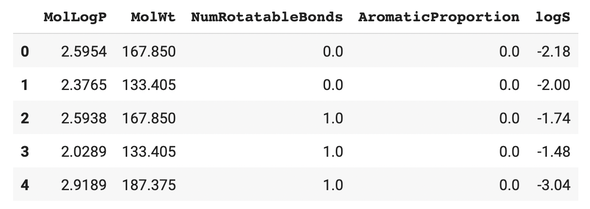
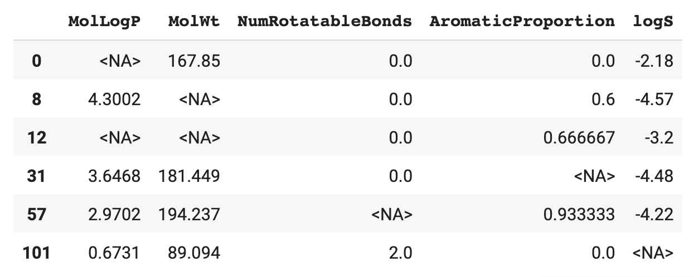

# 📓 Lesson 4 - Data wrangling with Pandas

<p align="center">
  
</p>

Pandas is a Python library that allows the loading, processing and wrangling of data. With Pandas you can gain access to data from a multitude of input sources such as CSV, TSV, Excel, SQL databases, JSON, etc. Afterwards, data can be exported out in the aforementioned formats as well.

## Installing Pandas

Let's start by installing Pandas that can be performed as follows:

```
pip install pandas
```

## Using Pandas

To start using Pandas, we can import Pandas as follows:
```Python
import pandas as pd
```

## Pandas data structure

Pandas allow us to work with tabular datasets. Let us take a look at the basic data structures of Pandas that consists of 3 types as follows (i.e. the first two are the data structures while the latter serves as a point of reference):

1. Series
2. DataFrame
3. Index

In a nutshell, you will see that a ***Pandas DataFrame*** and ***Pandas Series*** are labeled data (i.e. it has row names and column names). 

You’ll also see that a ***Pandas DataFrame*** is a collection of Pandas Series (i.e. the individual columns and rows).

### Pandas Series

A ***Pandas Series*** is a one-dimensional array that is very much similar to the NumPy array but with the ability to be labeled (i.e. the axis label or also called the index). A Series can hold an integer, float, string, python object, etc. At a high-level, a Series can be thought of as a column in Microsoft Excel.

### Pandas DataFrame

A ***Pandas DataFrame*** is a two-dimensional array. At a high-level, a DataFrame can be thought of as the spreadsheet in Microsoft Excel (i.e. a M × N matrix where M denotes the rows and N the columns).

### Pandas Index

The ***index*** in Pandas is an inherent property of Series and DataFrame objects that serves as a point of reference as to which rows and/or columns to perform operations on (i.e. for a DataFrame) or the specific element in a Series to perform operations on. By default, Pandas automatically assigns index numbers starting from 0 to denote the row numbers or column numbers (i.e. if none are explicitly defined).

## Creation of Pandas Series and DataFrame

Let's create some Pandas Series and Pandas DataFrame.

### Pandas Series

A Pandas Series can be created using the `pd.Series()` command with a Python list as input arguments.

Consider the following elements inside the Python list:

```Python
# A list of integers
pd.Series([1,2,3,4,5])
```

```Python
# A list of integers and floats
pd.Series([1,2,3,4,5,3.5])
```

```Python
# A list of integers and a string
pd.Series([1,2,3,4,5,'a'])
```

```Python
# A list of strings
pd.Series(['apple','papayas','bananas','orange'])
```

As we can see above, by default, there are no Series name (*i.e.* column and row names as in a DataFrame). In the *Index* section below we will be adding the Series name.

### Pandas DataFrame

By default, we can see that the *Index* values are integers. In the *Index* section we will be adding a label instead.

```Python
# Creating a DataFrame from a NumPy array
n1 = np.array([[1, 2, 3], [4, 5, 6], [7, 8, 9]])
df1 = pd.DataFrame(n1)
df1
```

<p align="left">
  
</p>

### Pandas Index

Let's add some meaningful labels to the columns.

**Pandas Series**

```Python
# Creating a Series from a list
l2 = [1,2,3,4,5]
s2 = pd.Series(l2, name='A')
s2
```

**Pandas DataFrame**

```Python
# Creating a DataFrame from a NumPy array
n2 = np.array([[1, 2, 3], [4, 5, 6], [7, 8, 9]])

# Creating columns name
df2 = pd.DataFrame(n2, columns=['A', 'B', 'C'])
df2
```

<p align="left">
  
</p>


```Python
# Creating a DataFrame with column and row names
df3 = pd.DataFrame(n2, columns=['A', 'B', 'C'], index=['R1', 'R2', 'R3'])
df3
```

<p align="left">
  
</p>

```Python
# Row names (i.e. the index) in a DataFrame can be renamed by altering the .index
df4 = df3.copy()
df4.index = ['John', 'Mary', 'Somchai']
df4
```

<p align="left">
  
</p>

```Python
# Creating a DataFrame from a dictionary
d = {'A': [1, 2, 3], 'B': [4, 5, 6], 'C': [7, 8, 9]}
df5 = pd.DataFrame(d)
df5
```

<p align="left">
  
</p>

```Python
# Creating a DataFrame from a dictionary (with Index)
d = {'A': [1, 2, 3], 'B': [4, 5, 6], 'C': [7, 8, 9]}
df6 = pd.DataFrame(d, index=['John','Somchai','Sally'])
df6
```

<p align="left">
  
</p>

```Python
# Creating a DataFrame from a dictionary (with Index)
d = {'A': [1, 2, 3], 'B': [4, 5, 6], 'C': [7, 8, 9]}
df7 = pd.DataFrame(d)
df7.index = ['John','Somchai','Sally']
df7
```

<p align="left">
  
</p>


## Read CSV data

Let's consider a simple use case of Pandas that I use quite often, which is to read in a CSV data:

```Python
df = pd.read_csv('data.csv')
```

In the above example, we are reading from a local file. However, if the CSV file is located on the cloud, it could also be read in a similar fashion. So instead of the file name, you can paste in the URL of the CSV file:

```Python
df = pd.read_csv('https://raw.githubusercontent.com/dataprofessor/data/master/delaney_solubility_with_descriptors.csv')
```

To display the CSV data, this is as simple as calling the `df` variable:

```Python
df
```

which yields the following DataFrame:

<p align="left">
  
</p>

As we can see, the DataFrame could be thought of as an $m×n$ matrix with $m$ rows and $n$ columns.

> 💡 **Note:** Reading in Excel file works in the same way and instead of `pd.read_csv` we'll use the `pd.read_excel` command.

## Getting to know the data

### Data dimension

To figure out how many rows and columns your data has you can use the `shape` method, which is appended as a suffix to a Pandas object.

For example, to apply the `shape` method on the DataFrame object that is stored in the `df` variable we would run `df.shape`. 

Firstly, we'll read in data from a CSV file as mentioned above.

```Python
df = pd.read_csv('https://raw.githubusercontent.com/dataprofessor/data/master/delaney_solubility_with_descriptors.csv')
```

Secondly, we determine the dimension of the data:
```Python
df.shape
```

This produces a tuple telling us the number of rows and columns are presented in the DataFrame:

(1144, 5)

### Summary information of a DataFrame

We can quickly obtain information (*e.g.* dtype, columns, non-null values and memory usage) about a DataFrame by using the `info` method.

```Python
df.info()
```

<p align="left">
  
</p>

### Exploring the DataFrame

`head()` - Explore the first few rows.

`tail()` - Explore the last few rows.

You can also explicitly specify a number inside to tell it to show exactly ***N*** number of rows.


**head()**

As the name implies, `head()` allows the display of the first few rows. 

By default, 5 rows will be shown:

```Python
df.head()
```

<p align="left">
  
</p>

You can also explicitly specify a number inside to tell it to show exactly N number of rows.

```Python
df.head(3)
```

<p align="left">
  
</p>

**tail()**

As the name implies, `tail()` allows the display of the last few rows. 

By default, 5 rows will be shown.

```Python
df.tail()
```

<p align="left">
  
</p>

You can also explicitly specify a number inside to tell it to show exactly N number of rows.

```Python
df.tail(3)
```

<p align="left">
  
</p>


## Selection of columns

### Selecting a single column

To select specific columns (such as the *MolWt* column) we can run the following:
```Python
df['MolLogP']
```
which produces the following Series output:
<p align="left">
  
</p>

In addition to the above method, one can use any of the 3 approaches:

```Python
df.MolLogP
```

```Python
df.loc[:, 'MolLogP']
```

```Python
# Note that MolLogP is located at the first column and thus the index of 0
df.iloc[:, 0]
```


### Selecting multiple columns

To select multiple columns (such as *MolWt* and *MolWt*) we can run the following:
```Python
df[['MolLogP','MolWt']]
```
which produces the following DataFrame output:
<p align="left">
  
</p>

## Filtering data

Data filtering can be performed by specifying a single or more criteria.

### Filtering by a single threshold value
Let's say that we would like to filter the data according to certain threshold value such as displaying the same data set where the MolLogP is less than 2:

```Python
df[df.MolLogP < 2]
```

<p align="left">
  
</p>

As a result, this led to a subset of the data with 479 rows from the total of 1144 rows.

### Filtering by applying multiple criteria

Instead of filtering the data according to a single criteria as shown above, we can specify multiple criteria as shown below where we display data where *MolLogP* is less than 2 **AND** *logS* is greater than -1:

```Python
df[(df.MolLogP < 2) & (df.logS > -1)]
```

<p align="left">
  
</p>

Let's modify the above filter by displaying data where *MolLogP* is less than 2 **OR** *logS* is greater than -1:

```Python
df[(df.MolLogP < 2) | (df.logS > -1)]
```

<p align="left">
  
</p>

## Pandas Index

The Pandas Index essentially serves 3 roles:
1. Identification
2. Selection
3. Alignment

### Both rows and columns have Index

You can think of the Pandas Index as sort of like the address that you can use in identifying the specific rows or columns.

> 💡 **Note:** It should be noted that the index is not considered to be a part of the DataFrame's dimensions.


Let's apply the `index` method to the DataFrame to display the row names.
```Python
df.index
```
```
RangeIndex(start=0, stop=1144, step=1)
```

Let's apply the `columns` method to the DataFrame to display the column name.
```Python
df.columns
```
```
Index(['MolLogP', 'MolWt', 'NumRotatableBonds', 'AromaticProportion', 'logS'], dtype='object')
```

### Index for Identification

In our data filtering example shown above and also displayed below, it can be noticed that the row number is retained when rows were removed as a result of the filtering.

```Python
df[(df.MolLogP < 2) & (df.logS > -1)]
```

<p align="left">
  
</p>

Thus, we can see that the filtered DataFrame had row names of 7, 19, 26, 29, etc. Make note that rows 0-6, 8-18, 20-25, 27-28 were removed as a result of meeting the filter criteria.

### Index for Selection

#### loc method

Firstly, **loc** is a method for selecting columns and filtering rows by **label** (i.e. row index and column names).

The following 2 approaches will give rise to the same output.

```Python
# 1. Selects the first row and all columns (explicit)
df.loc[0, :]
```

```Python
# 2. Selects the first row and all columns (implicit)
df.loc[0]
```

The display output for the 2 above mentioned commands is shown below:
```
MolLogP                 2.5954
MolWt                 167.8500
NumRotatableBonds       0.0000
AromaticProportion      0.0000
logS                   -2.1800
Name: 0, dtype: float64
```

Let's now select all rows and a specific column (*MolLogP*):
```Python
# Selects all rows and the MolLogP column
df.loc[:, 'MolLogP']
```
```
0       2.59540
1       2.37650
2       2.59380
3       2.02890
4       2.91890
         ...   
1139    1.98820
1140    3.42130
1141    3.60960
1142    2.56214
1143    2.02164
Name: MolLogP, Length: 1144, dtype: float64
```

Let's now try to select the first row and the *MolLogP* column:
```Python
# Select the first row and the MolLogP column
df.loc[0, 'MolLogP']
```
```
2.5954000000000006
```


#### iloc method

Secondly, **iloc** is a method for filtering rows and selecting columns based on the *position integers*.

Let's consider three examples.

In this first example, we're going to select and display data from the first row and all columns:
```Python
# Selects the first row and all columns
df.iloc[0, :]
```
```
MolLogP                 2.5954
MolWt                 167.8500
NumRotatableBonds       0.0000
AromaticProportion      0.0000
logS                   -2.1800
Name: 0, dtype: float64
```

In this second example, we're going to display only a single value from the first row and first column: 
```Python
# Selects the first row and the first column
df.iloc[0, 0]
```
```
2.5954000000000006
```

In this third example, we're going to display data from the first columns (and all rows):
```Python
# Selects all rows and the first column
df.iloc[:, 0]
```
```
0       2.59540
1       2.37650
2       2.59380
3       2.02890
4       2.91890
         ...   
1139    1.98820
1140    3.42130
1141    3.60960
1142    2.56214
1143    2.02164
Name: MolLogP, Length: 1144, dtype: float64
```


### Index for Alignment

We know that Pandas Index serves as a unique identifier. As a result, it keeps track of the individual rows or columns when we perform operations on them.

Let's say that we have created a Pandas Series that has row names of `0, 1, 1143`:
```Python
s1 = pd.Series([1,5,10], index=[0, 1, 1143], name = 'A')
s1
```
```
0        1
1        5
1143    10
Name: A, dtype: int64
```


In our forthcoming example, we're going to use the MolLogP column from the DataFrame:
```Python
df.MolLogP
```
```
0       2.59540
1       2.37650
2       2.59380
3       2.02890
4       2.91890
         ...   
1139    1.98820
1140    3.42130
1141    3.60960
1142    2.56214
1143    2.02164
Name: MolLogP, Length: 1144, dtype: float64
```


If we were to perform an operation between the above Pandas Series and a column from our DataFrame mentioned above, like so:
```Python
df.MolLogP * s1
```

This will lead to the following output:
```
0        2.5954
1       11.8825
2           NaN
3           NaN
4           NaN
         ...   
1139        NaN
1140        NaN
1141        NaN
1142        NaN
1143    20.2164
Length: 1144, dtype: float64
```

Here, we can notice that the display output shows the multiplication operation as performed on rows 0, 1 and 1143, which corresponds to the same row names specified by the Pandas Series `s1`. 

Particularly, the value `2.59540` from row 0 of the `df.MolLogP` column was multiplied by the value of `1` from row 0 of the `s1` Series. This multiplication led to a value of `2.5954`.

Next, we have the value `2.37650` from row 1 of the `df.MolLogP` column was multiplied by the value of `5` from row 1 of the `s1` Series. This multiplication led to a value of `11.8825`.

Finally, we have the value `2.02164` from row 1143 of the `df.MolLogP` column was multiplied by the value of `10` from row 1143 of the `s1` Series. This multiplication led to a value of `20.2164`.

We can also notice that all other rows that were not mentioned in the row names of the `s1` Series were also not involved in the multiplication operation and thus displayed values of `NaN`.

### Renaming the Index

#### Renumbering the index
Let's say that we would like to rename the index values but before doing so, we're going to display the original DataFrame:
```Python
df
```
<p align="left">
  
</p>
Notice that the index value starts from 0 and ends at 1143.


We're going to use the `arange()` method from NumPy to generate a list of values starting from 1 and running up to but not including 1145 (where values proceeds in increment of 1).
```Python
df.index = np.arange(1,1145,1)
```
<p align="left">
  
</p>
Notice that the index value now starts from 1 and ends at 1144.

#### Renaming the index with strings

What if we would like to use strings as part of the index name, such as `mol99`, we certainly can.

Let's start by creating a list of such strings.

```Python
id_list = []
for i in np.arange(1,1145,1):
  a = 'mol'+str(i)
  id_list.append(a)
```
```
['mol1',
 'mol2',
 'mol3',
...
 'mol1142',
 'mol1143',
 'mol1144']
```

A one-liner version can also be used:
```Python
id_list = ['mol'+str(i) for i in np.arange(1,1145,1)]
```

Finally, we'll replace the index values with the newly generated ones:
```Python
df.index = id_list
```

The DataFrame should now show the new index values:
```Python
df
```

<p align="left">
  
</p>


## Handling Missing Data

Let's now consider how to handle missing data and in order to do that, sometimes it is also helpful to consider the non-missing data.
1. `isnull` is a function for detecting missing values
2. `notnull` is a function for detecting non-missing values

### Detect missing data

Perhaps the first thing that we want to do is to determine whether the data being analyzed contains any missing data or not.

Particularly, the `isnull()` method appended after `df` would allow us to display a DataFrame showing whether each cell value is null (if it has missing data it will display a value of `False`) or not

```Python
df.isnull()
```
<p align="left">
  
</p>


Instead of showing a DataFrame of `True`/`False` values, let's display a summarized version where the sum of missing values is displayed for each column.

```Python
df.isnull().sum()
```
```
MolLogP               0
MolWt                 0
NumRotatableBonds     0
AromaticProportion    0
logS                  0
dtype: int64
```

Here, we can see that our dataset contains no missing data. So let's artificially add missing data so that we can proceed further with the tutorial. To do this, we're going to assign missing data by using `pd.NA` to specific cells of the DataFrame.

```Python
df.iloc[0, 0] = pd.NA
df.iloc[12, 0] = pd.NA
df.iloc[8, 1] = pd.NA
df.iloc[12, 1] = pd.NA
df.iloc[57, 2] = pd.NA
df.iloc[31, 3] = pd.NA
df.iloc[101, 4] = pd.NA
```

We can see that we have added missing data to arbitrary cells of the DataFrame.

Let's proceed to detect missing data in the DataFrame:

```Python
df.isnull().sum()
```
```
MolLogP               2
MolWt                 2
NumRotatableBonds     1
AromaticProportion    1
logS                  1
dtype: int64
```

> 💡 **Note:** In addition to `isnull()` you can also use `isna()`, which should give the same outcome.

Here, comes the fun part, let's display the DataFrame again but this time only rows with at least one missing value is shown:

```Python
df[df.isnull().any(axis = 1)]
```
<p align="left">
  
</p>

### Detect non-missing data

This is the opposite to the previous function where we are checking for non-missing data.

```Python
df.notnull()
```


### Drop missing data

In handling missing data, you can decide to either drop the missing data or fill in missing data with replacement values.

Let's drop rows that have at least 1 missing value:

```Python
df.dropna()
```

<p align="left">
  
</p>

We can see from the above that 6 rows with missing data have been removed from the DataFrame thereby reducing the number of rows from 1144 to 1138.

> 💡 **Note:** It is worth to mention that the above did not save the new DataFrame to the existing DataFrame. Thus, we can add the argument `inplace=True` in order to save the new DataFrame with no missing data to the existing `df` DataFrame.

```Python
df.dropna(inplace=True)
```


### Replace missing data

In handling missing data, you can decide to either drop the missing data or fill in missing data with replacement values.

Let's replace missing values with the column's mean:

```Python
df.fillna(df.mean())
```
<p align="left">
  
</p>

Or instead the column's median:

```Python
df.fillna(df.median())
```
<p align="left">
  
</p>


## Summary

In this lesson, we've covered how to install the Pandas library, Pandas data structure, creation of Pandas Series and DataFrame, reading in CSV files, selecting columns and dropping missing data from the DataFrame. Finally, we've also used Pandas in a Streamlit app.
