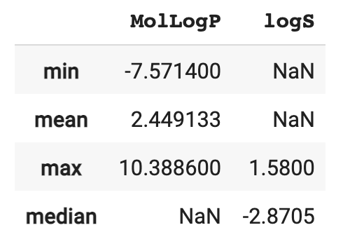
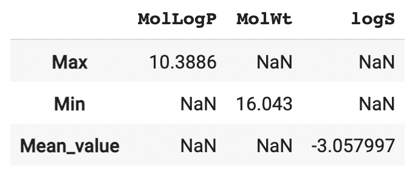
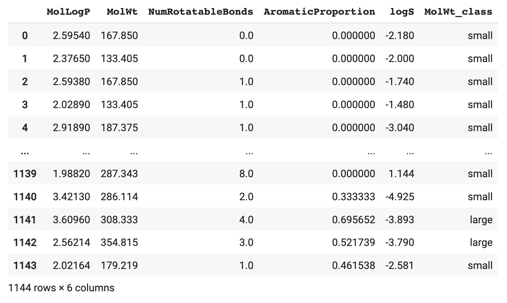
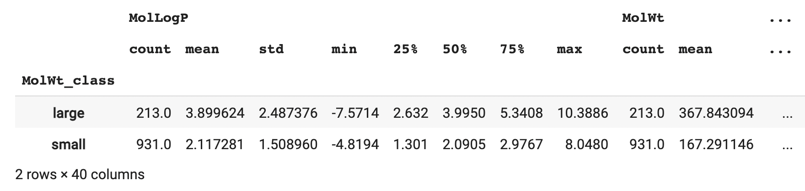
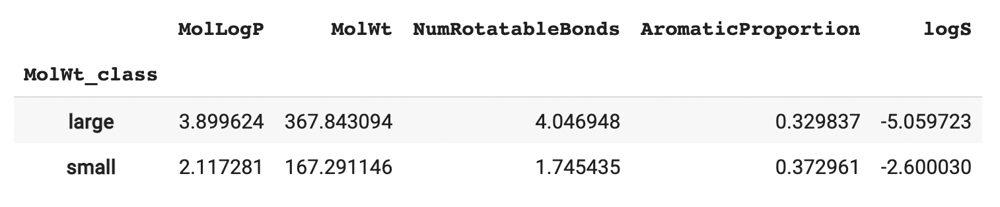
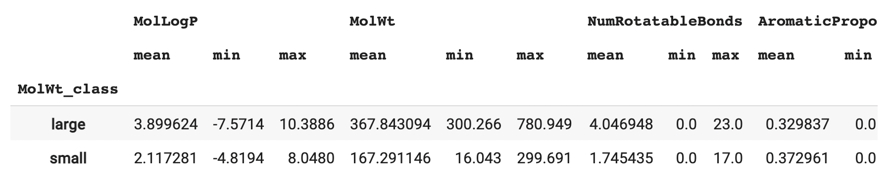
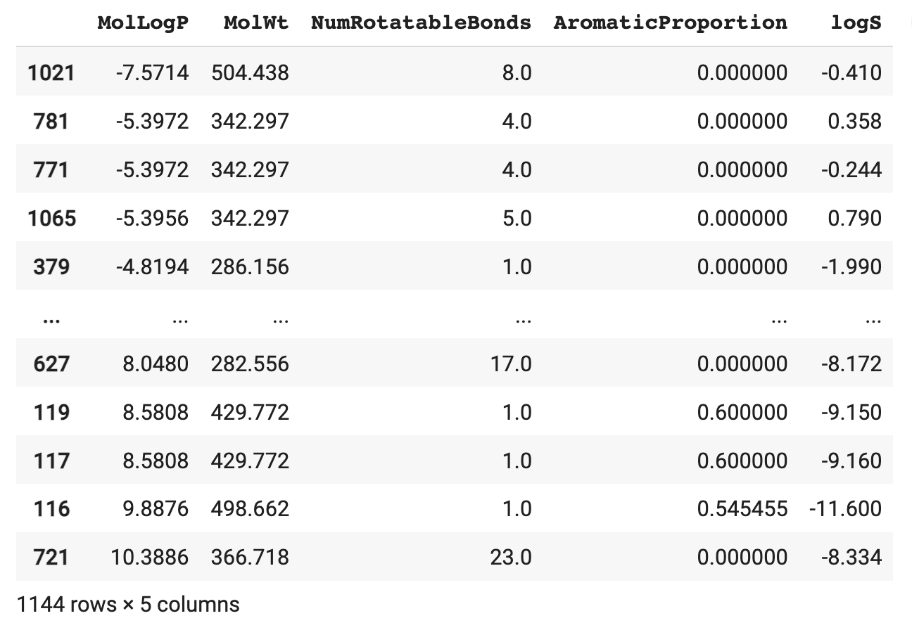
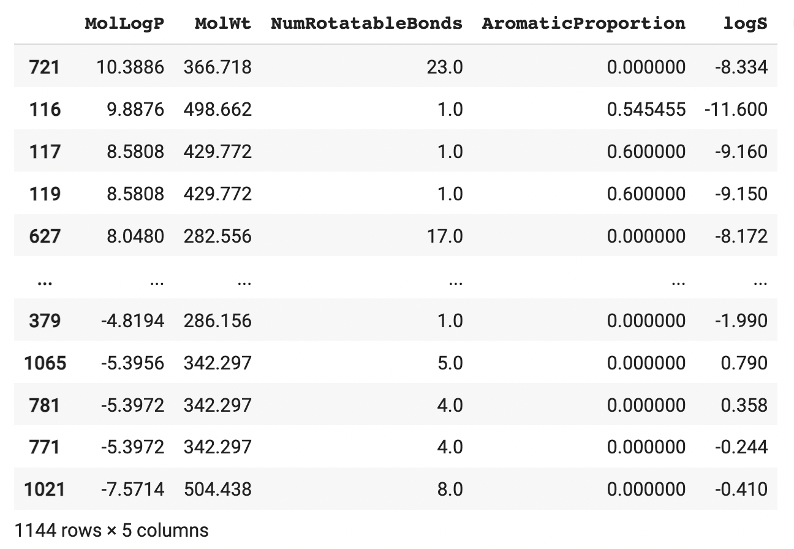
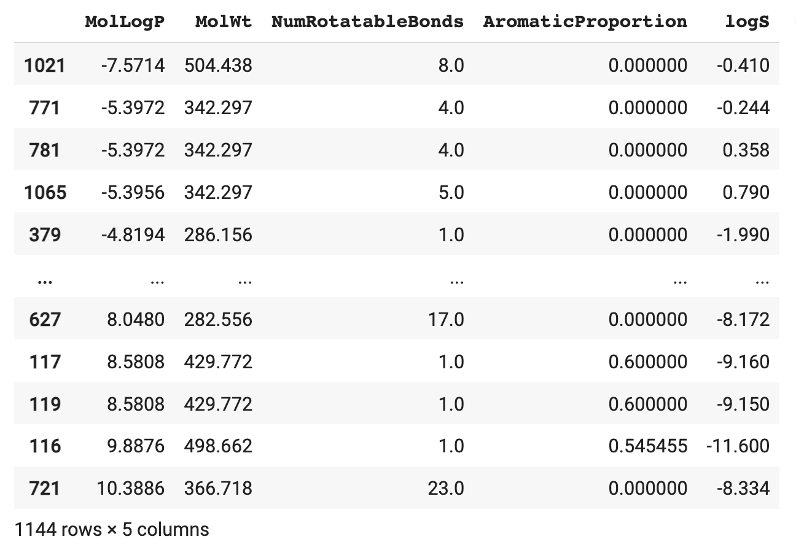

# 📓 Lesson 5 - Exploratory Data Analysis with Pandas

<p align="center">
  
</p>

In the previous lesson, we've explored how Pandas can be used to perform data wrangling. In this lesson, we're going to take this a step further and take a look at how we can also use Pandas to explore the data.

Thus, we're going to perform preliminary statistical analysis and generate simple visualizations of the data purely in Pandas without the need to use any external libraries.

## Loading the data

We're going to use the same dataset used in Lesson 4 which is the Delaney solubility data.

Let's start by loading the CSV data and assigning it to the `df` variable:
```Python
df = pd.read_csv('https://raw.githubusercontent.com/dataprofessor/data/master/delaney_solubility_with_descriptors.csv')
df
```

which yields the following DataFrame:

<p align="left">
  
</p>


## Summary Statistics

### Descriptive Statistics

The `describe()` function allows you to quickly compute descriptive statistics.

<p align="left">
  
</p>

### Value Counts

To examine the distribution of values for categorical values from any given column, we can use the `value_counts()` function.

```Python
df.NumRotatableBonds.value_counts()
```
which yields the following output:
```
0.0     362
1.0     239
2.0     178
3.0     103
4.0      88
5.0      58
6.0      40
8.0      24
7.0      22
9.0       9
10.0      6
12.0      4
14.0      3
16.0      2
13.0      2
15.0      1
17.0      1
23.0      1
11.0      1
Name: NumRotatableBonds, dtype: int64
```

### Transpose

To transpose a DataFrame we can use the `dataframe.T` function. A DataFrame is transposed when the rows and columns become inverted meaning that what was once the column will now become the rows and vice versa.

For comparative purpose, let's display the full DataFrame:
```Python
df
```
<p align="left">
  
</p>

To transpose, we'll simply add `T` as a suffix to `df`:
```Python
df.T
```
<p align="left">
  
</p>

Here, we can see that the 1144 rows and 5 columns of the first DataFrame became 5 rows and 1144 columns in the second DataFrame.

## Aggregates

Aggregates is a way of summarizing a collection of values into a single value. 

Examples of aggregates and their corresponding methods in parenthesis.
- Count (`count()`)
- Minimum (`min()`)
- Maximum (`max()`)
- Mean (`mean()`)
- Median (`median()`)
- Sum (`sum()`)
- Standard deviation (`std()`)

### Single aggregate

Let's start by computing a single type of aggregate, that is either each of the count, minimum, maximum, mean, etc., one at a time. 

#### Apply to all columns in a DataFrame

In practice, if you would like to determine the mean for all columns in a DataFrame, you can apply the `mean()` method on the `df` DataFrame:
```Python
df.mean()
```
This generates the corresponding mean values for all columns:
```
MolLogP                 2.449133
MolWt                 204.631675
NumRotatableBonds       2.173951
AromaticProportion      0.364932
logS                   -3.057997
dtype: float64
```

#### Apply to a single column in a DataFrame

To compute the mean for a single column, one can start by selecting the column as in `df.MolLogP` followed by applying `mean()` on the selected column.

```Python
df.MolLogP.mean()
```
This produces the mean value for the column of interest:
```
2.4491331818181825
```

> 💡 **Note:** The same principle applies to the remaining aggregate measures such as as count, minimum, maximum, etc. where instead of `mean()` as used in the example above, for instance, you can use `count()` to obtain the count measure; and so forth.

### Multiple aggregate

In the above section, we can also retrieve a single aggregate measure at a time, for example, we can obtain the mean value if we apply the `mean()` method or the sum value if we apply the `sum()` method.

The `aggregate()` or its alias `agg()` methods can be used to retrieve multiple aggregate measures at the same time.

Apply multiple aggregate measures over the rows:

```Python
df.aggregate(['max','min', 'mean'])
```
<p align="left">
  
</p>

Apply different aggregations per column:

```Python
df.agg({'MolLogP' : ['min', 'mean', 'max'], 'logS' : ['median', 'max']})
```
<p align="left">
  
</p>

Aggregate different measures over the columns and rename the index of the resulting DataFrame:

```Python
df.agg(Max=('MolLogP', 'max'), Min=('MolWt', 'min'), Mean_value=('logS', 'mean'))
```
<p align="left">
  
</p>

## Group By

The Group By function is essentially performing the following steps: **split-apply-combine**. For this, we can make use of the `groupby()` method on the Pandas DataFrame.

### Preparing the data

Before we can proceed to using the Group By function, let's first prepare our data to have categorical labels.

Particularly, we're going to create subset our dataset by labeling rows having `MolWt < 300` as `small` while those having `MolWt >= 300` as `large`. Such new labels will be assigned to a new column called `MolWt_class`.

```Python
df['MolWt_class'] = pd.Series(['small' if x < 300 else 'large' for x in df['MolWt']])
df
```
<p align="left">
  
</p>

### Applying the groupby function

Now that we have prepared our data to have categorical labels for the `MolWt` column, let's apply the `groupby` function on this column followed by chaining subsequent methods such as `describe()`, `mean()`, `agg()`, etc.

Firstly, we group the data by the `MolWt` column followed by applying the `describe()` method. What we get is the descriptive statistics for the 2 underlying classes of the `MolWt` column namely `large` and `small`.
```Python
df.groupby('MolWt_class').describe()
```
<p align="left">
  
</p>


Secondly, we group the data by the `MolWt` column followed by applying the `mean()` method. What we get is the mean value for the 2 underlying classes of the `MolWt` column namely `large` and `small`.
```Python
df.groupby('MolWt_class').mean()
```
<p align="left">
  
</p>


Thirdly, we group the data by the `MolWt` column followed by applying the `agg()` method along with a list of 3 aggregate measures. What we get is the 3 aggregate measures for the 2 underlying classes of the `MolWt` column namely `large` and `small`.
```Python
df.groupby('MolWt_class').agg(['mean', 'min', 'max'])
```
<p align="left">
  
</p>

> 💡 **Note:** The same principle also applies to the remaining aggregate measures such as:
> - Count (`count()`)
> - Minimum (`min()`)
> - Maximum (`max()`)
> - Mean (`mean()`)
> - Median (`median()`)
> - Sum (`sum()`)
> - Standard deviation (`std()`)

## Sort values

Often times it may be extremely helpful to perform simple tasks like sorting columns while exploring the data. Such task would help in figuring out which rows afforded high or low values (or any obvious trends that can be readily detected visually) for columns of interests. 


### Sorting a single column

Sorting columns in a spreadsheet software like Excel, Sheets or Numbers may be a trivial task of simpling clicking on the column name but for Pandas that may not be the case. Particularly, one can sort values in a Pandas DataFrame by using the `sort_values()` method while specifying which columns as input arguments.

As an example, let's try sorting the DataFrame by a specific column (e.g. `MolLogP`).
```Python
df.sort_values(by=['MolLogP'])
```

<p align="left">
  
</p>
Notice how values in the `MolLogP` column now starts from a negative value and ascends (increase) as we scroll down the column. Speaking of ascending values, by default the `ascend` input parameter of the `sort_values()` method defaults to `True` meaning that it will sort values by ascending order like what we had just described.


Try explicitly defining `ascending=True` and you'll see that it returns the exact same output as shown above as `ascending` implicitly defaults to True.
```Python
df.sort_values(by=['MolLogP'], ascending=True)
```
<p align="left">
  
</p>


Let's now try sorting the column again using `ascending=False`:
```Python
df.sort_values(by=['MolLogP'], ascending=False)
```
<p align="left">
  
</p>


### Sorting multiple columns

It may also be helpful to explicitly define the input arguments so as to prevent confusion on whether the columns were sorted in ascending or descending order.

```Python
df.sort_values(by=['MolLogP', 'MolWt'], ascending=True)
```
<p align="left">
  
</p>


```Python
df.sort_values(by=['MolLogP', 'MolWt'], ascending=False)
```
<p align="left">
  
</p>


