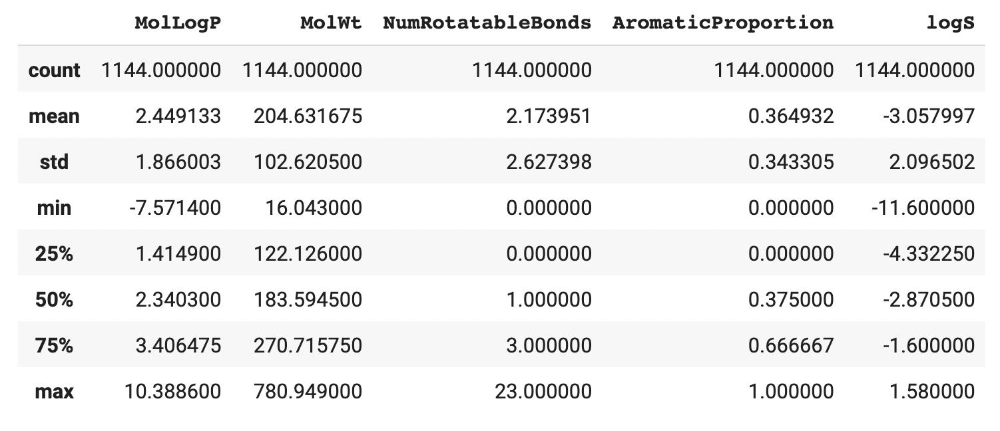
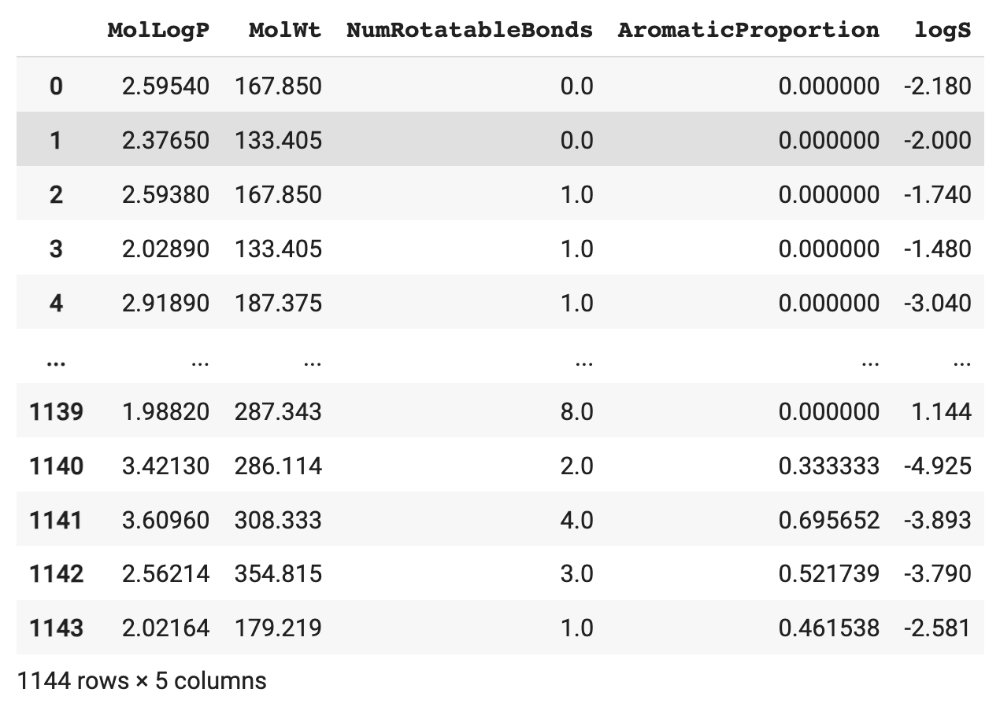
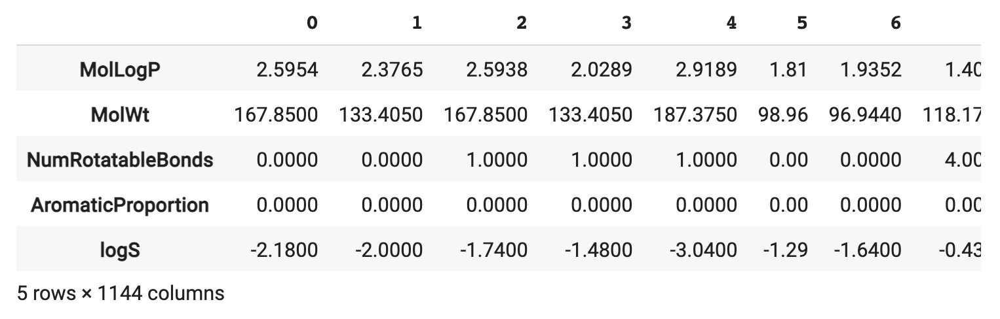
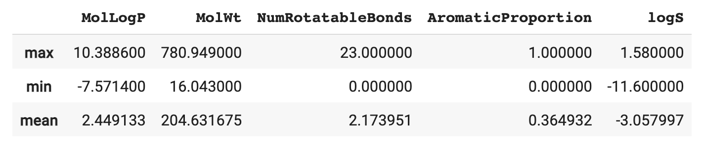

# 📓 Lesson 5 - Exploratory Data Analysis with Pandas

<p align="center">
  
</p>

In the previous lesson, we've explored how Pandas can be used to perform data wrangling. In this lesson, we're going to take this a step further and take a look at how we can also use Pandas to explore the data.

Thus, we're going to perform preliminary statistical analysis and generate simple visualizations of the data purely in Pandas without the need to use any external libraries.

## Summary Statistics

### Descriptive Statistics

The `describe()` function allows you to quickly compute descriptive statistics.

<p align="left">
  
</p>

### Value Counts

To examine the distribution of values for categorical values from any given column, we can use the `value_counts()` function.

```Python
df.NumRotatableBonds.value_counts()
```
which yields the following output:
```
0.0     362
1.0     239
2.0     178
3.0     103
4.0      88
5.0      58
6.0      40
8.0      24
7.0      22
9.0       9
10.0      6
12.0      4
14.0      3
16.0      2
13.0      2
15.0      1
17.0      1
23.0      1
11.0      1
Name: NumRotatableBonds, dtype: int64
```

### Transpose

To transpose a DataFrame we can use the `dataframe.T` function. A DataFrame is transposed when the rows and columns become inverted meaning that what was once the column will now become the rows and vice versa.

For comparative purpose, let's display the full DataFrame:
```Python
df
```
<p align="left">
  
</p>

To transpose, we'll simply add `T` as a suffix to `df`:
```Python
df.T
```
<p align="left">
  
</p>

Here, we can see that the 1144 rows and 5 columns of the first DataFrame became 5 rows and 1144 columns in the second DataFrame.

## Aggregates

Aggregates is a way of summarizing a collection of values into a single value. 

Examples of aggregates and their corresponding methods in parenthesis.
- Count (`count()`)
- Minimum (`min()`)
- Maximum (`max()`)
- Mean (`mean()`)
- Median (`median()`)
- Sum (`sum()`)
- Standard deviation (`std()`)

### Single aggregate

Let's start by computing a single type of aggregate, that is either each of the count, minimum, maximum, mean, etc., one at a time. 

#### Apply to all columns in a DataFrame

In practice, if you would like to determine the mean for all columns in a DataFrame, you can apply the `mean()` method on the `df` DataFrame:
```Python
df.mean()
```
This generates the corresponding mean values for all columns:
```
MolLogP                 2.449133
MolWt                 204.631675
NumRotatableBonds       2.173951
AromaticProportion      0.364932
logS                   -3.057997
dtype: float64
```

#### Apply to a single column in a DataFrame

To compute the mean for a single column, one can start by selecting the column as in `df.MolLogP` followed by applying `mean()` on the selected column.

```Python
df.MolLogP.mean()
```
This produces the mean value for the column of interest:
```
2.4491331818181825
```

> 💡 **Note:** The same principle applies to the remaining aggregate measures such as as count, minimum, maximum, etc. where instead of `mean()` as used in the example above, for instance, you can use `count()` to obtain the count measure; and so forth.

### Multiple aggregate

In the above section, we can also retrieve a single aggregate measure at a time, for example, we can obtain the mean value if we apply the `mean()` method or the sum value if we apply the `sum()` method.

The `aggregate()` or its alias `agg()` methods can be used to retrieve multiple aggregate measures at the same time.

```Python
df.aggregate(['max','min', 'mean'])
```

<p align="left">
  
</p>
