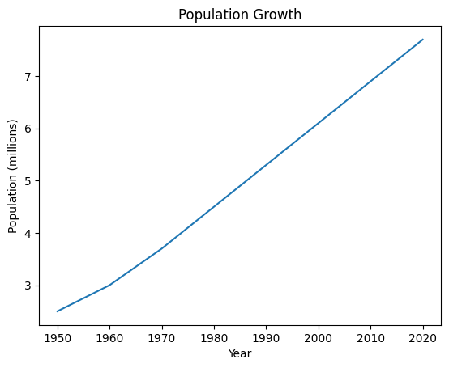
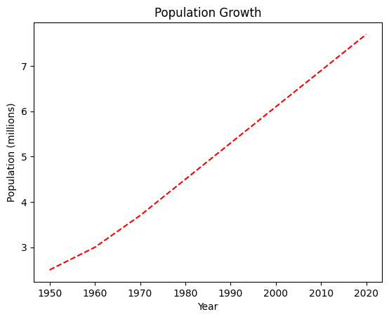
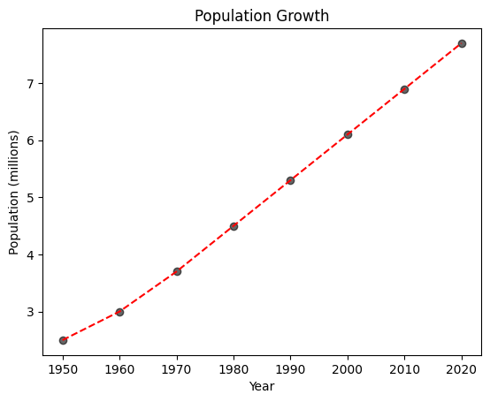
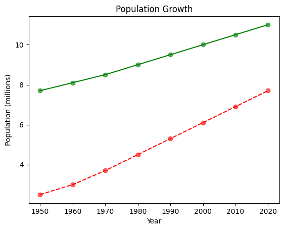

# 📓 Lesson 6 - Data Visualization with Matplotlib

<p align="center">
  
</p>

Data visualization is an important topic that allows us to represent complex data in a visually appealing and summarized manner. We often hear that a picture is worth a thousand words and this could be said for visualizations of data.

In this lesson, we're going to create some data visualizations using the `Matplotlib` library.

## Installing Matplotlib

Firstly, open up a terminal window and install Matplotlib via pip as follows:
```
pip install matplotlib
```

## Creating a basic plot using Matplotlib

Let's start by creating a simple plot using Matplotlib. 

## Line graph
Here, we're going to plot a simple line graph that shows the population growth of a hypothetical city over time using the following code:

```python
import matplotlib.pyplot as plt

# Data
years = [1950, 1960, 1970, 1980, 1990, 2000, 2010, 2020]
population = [2.5, 3.0, 3.7, 4.5, 5.3, 6.1, 6.9, 7.7]

# Create plot
plt.plot(years, population)

# Show plot
plt.show()
```
<details>
  <summary><i>See code explanation</i></summary>

Here's a line-by-line breakdown of the code:
  1. Import the `matplotlib.pyplot` as `plt` (so that we can later refer to `matplotlib.pyplot` literally as `plt` instead of having to type the full version of `matplotlib.pyplot`.
  2. Create `years` and `population` variables that will be used for subsequent steps in creating the plot.
  3. Create the plot via `plt.plot()` and specifying `years` and `population` as input arguments. This will create a line plot.
  4. Finally, we're going to display the plot via `plt.show()`.
</details>

This gives us the following plot:
<p align="left">
  
</p>


## Adding labels

Now, we're going to add labels to the X and Y axes:
```python
# Add labels
plt.title('Population Growth')
plt.xlabel('Year')
plt.ylabel('Population (millions)')
```

Adding this to the above code snippet in the above line plot gives us:
```python
import matplotlib.pyplot as plt

# Data
years = [1950, 1960, 1970, 1980, 1990, 2000, 2010, 2020]
population = [2.5, 3.0, 3.7, 4.5, 5.3, 6.1, 6.9, 7.7]

# Create plot
plt.plot(years, population)

# Add labels <- (New line of code)
plt.title('Population Growth')
plt.xlabel('Year')
plt.ylabel('Population (millions)')

# Show plot
plt.show()
```
<details>
<summary><i>See code explanation</i></summary>

Here's a line-by-line breakdown of the code:
  1. Import the `matplotlib.pyplot` as `plt` (so that we can later refer to `matplotlib.pyplot` literally as `plt` instead of having to type the full version of `matplotlib.pyplot`.
  2. Create `years` and `population` variables that will be used for subsequent steps in creating the plot.
  3. Create the plot via `plt.plot()` and specifying `years` and `population` as input arguments. This will create a line plot.
  4. **New line of code:** Add labels to the plot as well as the X and Y axes.
  5. Finally, we're going to display the plot via `plt.show()`.
</details>

This gives us the following revised plot with labels:
<p align="left">
  
</p>


## Line style and color

Let's perform customization to the plot. To customize the line style and color in our plot, we can pass in additional arguments to the plot function (i.e. `plt.plot()`). 

For example, we can change the line color from the default blue line to a red line by adding `r` as a third argument to the `plt.plot()` function. Additionally, the line style can be adjusted to a dashed line by adding `--` as a third argument. Taken together, we can add `r--` as the third argument as follows:
```python
plt.plot(years, population, 'r--')
```

Adding this to the full code gives us:
```python
import matplotlib.pyplot as plt

# Data
years = [1950, 1960, 1970, 1980, 1990, 2000, 2010, 2020]
population = [2.5, 3.0, 3.7, 4.5, 5.3, 6.1, 6.9, 7.7]

# Create plot
plt.plot(years, population, 'r--')

# Add labels
plt.title('Population Growth')
plt.xlabel('Year')
plt.ylabel('Population (millions)')

# Show plot
plt.show()
```
<details>
<summary><i>See code explanation</i></summary>

Here's a line-by-line breakdown of the code:
  1. Import the `matplotlib.pyplot` as `plt` (so that we can later refer to `matplotlib.pyplot` literally as `plt` instead of having to type the full version of `matplotlib.pyplot`.
  2. Create `years` and `population` variables that will be used for subsequent steps in creating the plot.
  3. Create the plot via `plt.plot()` and specifying `years` and `population` as input arguments. This will create a line plot.  
  4. **New line of code:** The line is changed to red dashed line via the third argument `r--`.
  5. Add labels to the plot as well as the X and Y axes.
  6. Finally, we're going to display the plot via `plt.show()`.
</details>

And the revised plot gives us the red dashed line:
<p align="left">
  
</p>

## Adding data points

We can also add data points to the plot by using the `plt.scatter()` function and while we're at it, let's also color the data points black (`c='k'`) and translucent (`alpha=0.6`):
```python
plt.scatter(years, population, c='k', alpha=0.6)
```

Adding this to the full code gives us the revised code:
```python
import matplotlib.pyplot as plt

# Data
years = [1950, 1960, 1970, 1980, 1990, 2000, 2010, 2020]
population = [2.5, 3.0, 3.7, 4.5, 5.3, 6.1, 6.9, 7.7]

# Create plot
plt.plot(years, population, 'r--')
plt.scatter(years, population, c='k', alpha=0.6)

# Add labels
plt.title('Population Growth')
plt.xlabel('Year')
plt.ylabel('Population (millions)')

# Show plot
plt.show()
```
<details>
<summary><i>See code explanation</i></summary>

Here's a line-by-line breakdown of the code:
  1. Import the `matplotlib.pyplot` as `plt` (so that we can later refer to `matplotlib.pyplot` literally as `plt` instead of having to type the full version of `matplotlib.pyplot`.
  2. Create `years` and `population` variables that will be used for subsequent steps in creating the plot.
  3. Create the plot via `plt.plot()` and specifying `years` and `population` as input arguments. This will create a line plot.  
  4. The line is changed to red dashed line via the third argument `r--`.
  5. **New line of code:** Data points are added via the `plt.scatter` function.
  6. Add labels to the plot as well as the X and Y axes.
  7. Finally, we're going to display the plot via `plt.show()`.
</details>

And the revised plot gives us additional black (translucent) data points:
<p align="left">
  
</p>

## Adding an additional line plot

Let's say that we want to add a second line (and data points) to the plot, we can by simply using `plt.plot` and `plt.scatter` again on a new set of data (i.e. `population2`).

```python
import matplotlib.pyplot as plt

# Data
years = [1950, 1960, 1970, 1980, 1990, 2000, 2010, 2020]
population = [2.5, 3.0, 3.7, 4.5, 5.3, 6.1, 6.9, 7.7]
population2 = [7.7, 8.1, 8.5, 9.0, 9.5, 10.0, 10.5, 11.0]

# Create plot
plt.plot(years, population, 'r--')
plt.scatter(years, population, c='r', alpha=0.6)

plt.plot(years, population2, 'g')
plt.scatter(years, population2, c='g', alpha=0.6)

# Add labels
plt.title('Population Growth')
plt.xlabel('Year')
plt.ylabel('Population (millions)')

# Show plot
plt.show()
```
<details>
<summary><i>See code explanation</i></summary>

Here's a line-by-line breakdown of the code:
  1. Import the `matplotlib.pyplot` as `plt` (so that we can later refer to `matplotlib.pyplot` literally as `plt` instead of having to type the full version of `matplotlib.pyplot`.
  2. Create `years` and `population` variables that will be used for subsequent steps in creating the plot.
  3. Create the plot via `plt.plot()` and specifying `years` and `population` as input arguments. This will create a line plot.  
  4. The line is changed to red dashed line via the third argument `r--`.
  5. Data points are added via the `plt.scatter` function.
  6. **New line of code:** A second green line with green translucent data points are also added here.
  7. Add labels to the plot as well as the X and Y axes.
  8. Finally, we're going to display the plot via `plt.show()`.
</details>

And the revised plot gives us a second green line (and while we're at it red data points for the first line):
<p align="left">
  
</p>

## Creating the plot in Streamlit

Before we can reproduce the plot in a Streamlit app, we're going to need to make some minor adjustments to the above code as follows:
- Firstly, we're going to import the Streamlit library via `import streamlit as st`.
- Secondly, we're adding the app's title via `st.title()`.
- Thirdly, we're going to define `fig` and `ax` via `fig, ax = plt.subplots()`, then subsequently replacing `plt` by `ax` for the plot creation (*i.e.* replacing `plt.plot()` by `ax.plot()` nad `plt.scatter()` by `ax.scatter`).
- Finally, to display the plot in a Streamlit app, instead of `plt.show()`, we're replacing that with `st.pyplot(fig)`.
This gives us the following revised code: 
```python
import streamlit as st
import matplotlib.pyplot as plt

st.title('📈 Line plot with Matplotlib')

# Data
years = [1950, 1960, 1970, 1980, 1990, 2000, 2010, 2020]
population = [2.5, 3.0, 3.7, 4.5, 5.3, 6.1, 6.9, 7.7]
population2 = [7.7, 8.1, 8.5, 9.0, 9.5, 10.0, 10.5, 11.0]

# Create plot
# Here we define fig and ax and subsequently replace plt by ax for the plots
fig, ax = plt.subplots()

ax.plot(years, population, 'r--')
ax.scatter(years, population, c='r', alpha=0.6)

ax.plot(years, population2, 'g')
ax.scatter(years, population2, c='g', alpha=0.6)

# Add labels
plt.title('Population Growth')
plt.xlabel('Year')
plt.ylabel('Population (millions)')

# Show plot
# Instead of plt.show() we're using st.pyplot
st.pyplot(fig)
```

