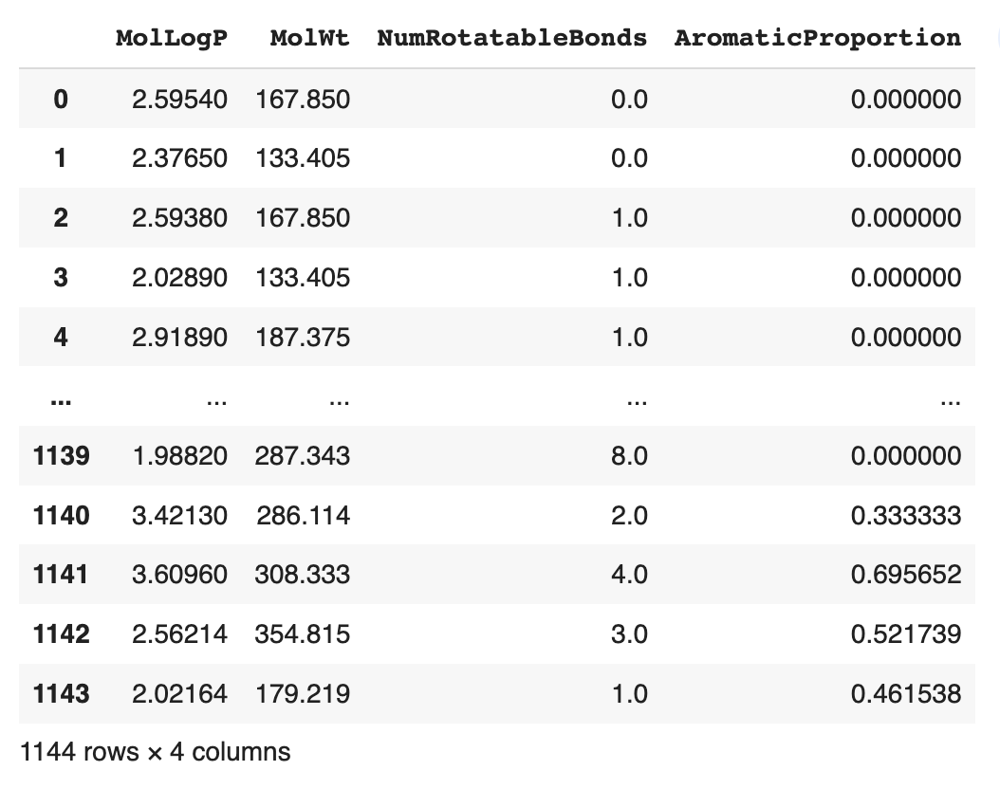

# 📓 Lesson 6 - Machine Learning with Scikit-learn

<p align="center">
  
</p>

The [Scikit-learn](https://scikit-learn.org/) library is the gold standard in performing machine learning in Python as it allows you to build machine learning models, prepare data, analyze data, and evaluate models. As the tool has been around for quite some time since 2007, there are extensive examples and resources that one can use to get started.

In this lesson, we're going to use the `Scikit-learn` library for the various phases in the data science cycle as mentioned earlier (e.g. build machine learning models, prepare data, analyze data, and evaluate models).

## Installing Scikit-learn

Firstly, open up a terminal window and install Scikit-learn via pip as follows:
```
pip install scikit-learn
```

## Data representation used in Scikit-learn 

We'll start with the basics by examining Scikit-learn's tabular representation of data.

The tabular dataset for a supervised learning problem will contain both **X** and **y** variables, while the tabular dataset for an unsupervised learning problem will contain only **X** variables.

As an overview, **X** variables are also known as independent variables, and they can describe samples of interest quantitatively or qualitatively, while **y** variables are known as dependent variables, and they serve as target or response variables used in predictive models.

<p align="center">
  
</p>

To illustrate, if we're constructing a model to predict whether individuals will have a disease or not, the disease/non-disease status is the **y** variable and clinical test results are the **X** variable.

## Loading data from a CSV file

A dataset can be stored as a CSV file and read using the Pandas library via the `pd.read_csv()` function. Hence, a Pandas DataFrame is used to represent the loaded data.

In the following example, we're loading in a CSV data stored on the cloud particularly in the GitHub repo.

```Python
# Load data
import pandas as pd

df = pd.read_csv('https://raw.githubusercontent.com/dataprofessor/data/master/delaney_solubility_with_descriptors.csv')
df
```

<p align="left">
  
</p>

## Separate data to X and y

Next, we'll separate the DataFrame as **X** and **y** variables that will be subsequently used for model building.

```Python
# Separate data as X and y
X = df.drop('logS', axis=1)
y = df['logS']
```

This gives us the following **X** variable:
<p align="left">
  
</p>

And the following **y** variable:

```
0      -2.180
1      -2.000
2      -1.740
3      -1.480
4      -3.040
        ...  
1139    1.144
1140   -4.925
1141   -3.893
1142   -3.790
1143   -2.581
Name: logS, Length: 1144, dtype: float64
```


## Data splitting

It is common to use a data splitting function to separate given inputs **X** and **y** variables into training and test sets (`X_train`, `Y_train`, `X_test`, `y_test`).

The code snippet below uses the `train_test_split()` function to split the data. Particularly, the size of the test set is specified to 0.2 (or 20%) and the random seed number set to 42 (so that the code block will produce the same data split if it is run multiple times).

```Python
from sklearn.model_selection import train_test_split

X_train, X_test, y_train, y_test = train_test_split(X, y, test_size=0.2, random_state=42)
```

Afterwards, let's take a look at the dimension size of the 4 data subsets using the `shape()` method. 

- Here's the dimension of **X** as determined via `shape()`:

```Python
X_train.shape, X_test.shape
```

```
((915, 4), (229, 4))
```

- Here's the dimension of **y** as determined via `shape()`:

```Python
y_train.shape, y_test.shape
```

```
((915,), (229,))
```

## Model building

Let's now use the generated data subsets to train a machine learning model.

```Python
# Model building
from sklearn.ensemble import RandomForestRegressor

rf = RandomForestRegressor(max_features=4, n_estimators=100)
rf.fit(X_train, y_train)
```

In the above code snippet, we're building a random forest model via the `RandomForestRegressor()` function and we've specified that the maximum number of features (*i.e.* the **X** variables) to use is 4 which corresponds to the 4 **X** variables.

## Apply trained model to make predictions

In essence, we're applying the trained random forest model to make predictions of `y` values for both `X_train` and `X_test`. Correspondingly, predicted values are stored in 2 variables: `y_train_pred` and `y_test_pred`. In other words, the model is taking in X to predict y values.

```Python
# Apply trained model to make predictions
y_train_pred = rf.predict(X_train)
y_test_pred = rf.predict(X_test)
```

Let's take a preview of the returned output from `y_train_pred`:

```
array([-4.46691333e+00, -8.09591000e+00, -4.08295400e+00,  5.71000000e-02,
       -1.30996667e+00, -1.96770000e+00, -7.56278571e-01, -1.96031667e+00,
       -3.30567810e+00, -2.12870000e+00, -4.18783333e+00, -8.19162667e+00,
       -3.70431617e+00, -7.78641667e-01, -1.72077000e+00, -4.63966667e-01,
       .....
       -1.34834000e+00, -6.75356917e+00, -5.36715167e+00, -8.04068993e+00,
       -3.82656667e+00, -1.21819667e+00, -7.25481667e-01, -1.83893000e+00,
       -1.27629714e+00, -7.06956102e+00, -3.41684400e+00, -1.80697000e+00,
       -5.54075000e+00, -4.73305000e+00, -6.44516500e+00])
```

## Evaluate model performance

Now that we have predicted y values for both the *train* and *test* subsets, we're going to calculate model performance metrics comprising of $R^2$ and mean squared error (MSE).

Here's how we can calculate the model performance metrics using Scikit-learn:

- $R^2$ can be calculated using the `r2_score()` function.
- MSE can be calculated using the `mean_squared_error()` function.

For both of these metrics, we're providing 2 input arguments namely the actual value (`y_train` or `y_test`) and the predicted value (`y_train_pred` or `y_test_pred`).

Let's put this in action:

```Python
# Evaluate model performance
from sklearn.metrics import mean_squared_error, r2_score

train_r2 = r2_score(y_train, y_train_pred)
test_r2 = r2_score(y_test, y_test_pred)

train_mse = mean_squared_error(y_train, y_train_pred)
test_mse = mean_squared_error(y_test, y_test_pred)
```

- The returned output for $R^2$ by running the following code:
```Python
train_r2, test_r2
```
gives us the following:
```
(0.9793095988902839, 0.8868388639174744)
```

- The returned output for MSE by running the following code:
```Python
train_mse, test_mse
```
gives us the following:
```
(0.09102390986320828, 0.49276498022937004)
```

## Model interpretation

Insights can be extracted from the model so as to drive the decision-making process. Here's how we can figure out which features are important and thus contribute to the model's prediction. 

Particularly, we can append `feature_importances_` to the instantiated model:
```Python
# Feature importance
rf.feature_importances_
```
This returns the following output:
```
array([0.82758671, 0.12854113, 0.02059104, 0.02328112])
```

Let's now add additional details to the above set of feature importance values, which are the feature names that are associated with the feature importance value.
```Python
# Name of features
X_train.columns
```
This returns the following output:
```
Index(['MolLogP', 'MolWt', 'NumRotatableBonds', 'AromaticProportion'], dtype='object')
```


## Data visualization of prediction results

Now that we have all of the prediction results in hand, let's now proceed to visualizing them.

Here, we're going to create a scatter plot of the actual versus predicted `logS` value using Matplotlib and NumPy

```Python
import matplotlib.pyplot as plt
import numpy as np

# Creating the scatter plot
plt.figure(figsize=(5,5))
plt.scatter(x=y_train, y=y_train_pred, c="#7CAE00" ,alpha=0.3)

# Adding the trend line
z = np.polyfit(y_train, y_train_pred, 1)
p = np.poly1d(z)
plt.plot(y_train, p(y_train), '#F8766D')

# Adding the label
plt.ylabel('Predict logS')
plt.xlabel('Experimental logS')
     
plt.show()
```


## Summary

In this lesson, we had learned the basics of using Scikit-learn to build machine learning models. Particularly, we started with loading in a CSV data, preprocessed it as data subsets, built a machine learning model that is subsequently used to predict the y values for both the train and test subsets, computing the model performance metrics, figuring out the feature importance and finally visualizing the prediction results. 

## Next step
> 🚀 Proceed to [**Project 5**](Project-5.md) to build a Streamlit app that shows the use of Scikit-learn to create an ML model in a Streamlit app.
