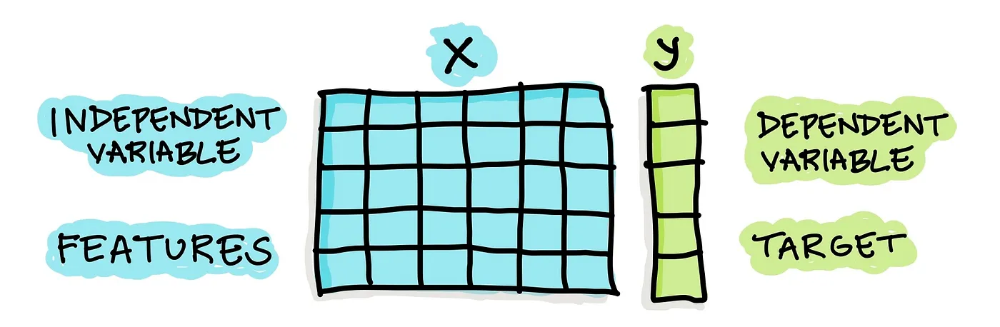
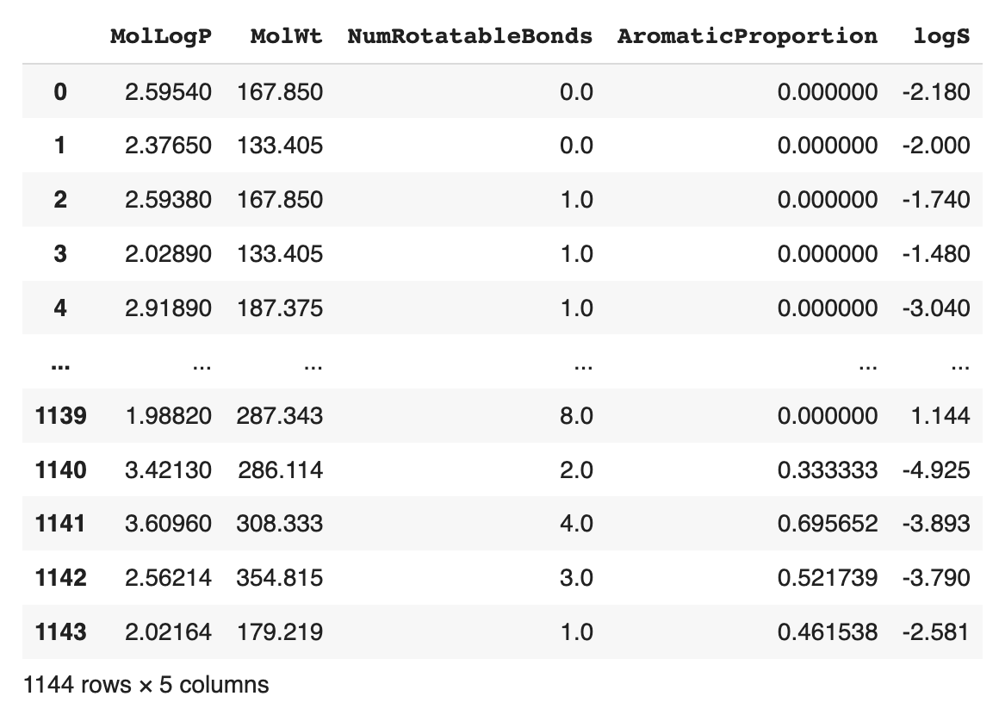

# 📓 Lesson 7 - Machine Learning with Scikit-learn

<p align="center">
  
</p>

The Scikit-learn library is the gold standard in performing machine learning in Python as it allows you to build machine learning models, prepare data, analyze data, and evaluate models. As the tool has been around for quite some time since 2007, there are extensive examples and resources that one can use to get started.

In this lesson, we're going to use the `Scikit-learn` library for the various phases in the data science cycle as mentioned earlier (e.g. build machine learning models, prepare data, analyze data, and evaluate models).

## Installing Scikit-learn

Firstly, open up a terminal window and install Scikit-learn via pip as follows:
```
pip install scikit-learn
```

## Data representation used in Scikit-learn 

We'll start with the basics by examining Scikit-learn's tabular representation of data.

The tabular dataset for a supervised learning problem will contain both **X** and **y** variables, while the tabular dataset for an unsupervised learning problem will contain only **X** variables.

As an overview, **X** variables are also known as independent variables, and they can describe samples of interest quantitatively or qualitatively, while **y** variables are known as dependent variables, and they serve as target or response variables used in predictive models.

<p align="center">
  
</p>

To illustrate, if we're constructing a model to predict whether individuals will have a disease or not, the disease/non-disease status is the **y** variable and clinical test results are the **X** variable.

## Loading data from a CSV file

A dataset can be stored as a CSV file and read using the Pandas library via the `pd.read_csv()` function. Hence, a Pandas DataFrame is used to represent the loaded data.

In the following example, we're loading in a CSV stored on the cloud in the GitHub repo.

```Python
# Load data
import pandas as pd

df = pd.read_csv('https://raw.githubusercontent.com/dataprofessor/data/master/delaney_solubility_with_descriptors.csv')
df
```

<p align="left">
  
</p>

## Separate data to X and y

Next, we'll separate the DataFrame as **X** and **y** variables that will be subsequently used for model building.

```Python
# Separate data as X and y
X = df.drop('logS', axis=1)
y = df['logS']
```

This gives us the following **X** variable:
<p align="left">
  
</p>

And the following **y** variable:

```
0      -2.180
1      -2.000
2      -1.740
3      -1.480
4      -3.040
        ...  
1139    1.144
1140   -4.925
1141   -3.893
1142   -3.790
1143   -2.581
Name: logS, Length: 1144, dtype: float64
```


## Data splitting

It is common to use a data splitting function to separate given inputs **X** and **y** variables into training and test sets (`X_train`, `Y_train`, `X_test`, `y_test`).

The code snippet below uses the `train_test_split()` function to split the data. Particularly, the size of the test set is specified to 0.2 (or 20%) and the random seed number set to 42 (so that the code block will produce the same data split if it is run multiple times).

```Python
from sklearn.model_selection import train_test_split

X_train, X_test, y_train, y_test = train_test_split(X, y, test_size=0.2, random_state=42)
```

Afterwards, let's take a look at the dimension size of the 4 data subsets using the `shape()` method. 

- Here's the dimension of X:

```Python
X_train.shape, X_test.shape
```

```
((915, 4), (229, 4))
```

- Here's the dimension of y:

```Python
y_train.shape, y_test.shape
```

```
((915,), (229,))
```

