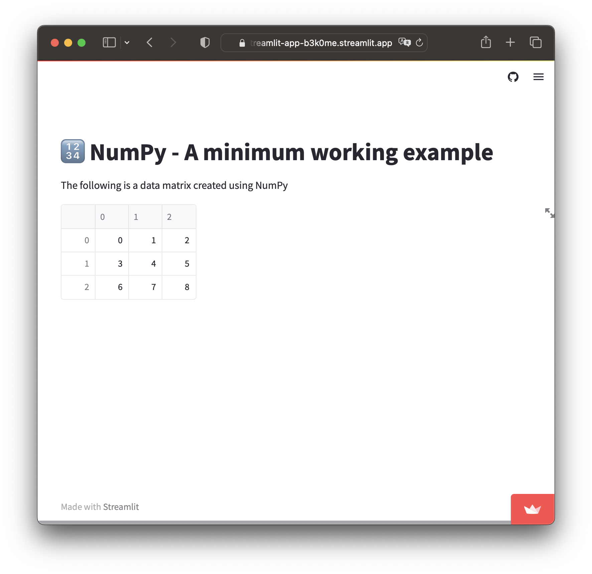

## Project 1 - Using NumPy in Streamlit

### What are we building?
NumPy can easily be used inside a Streamlit app, let's see how in this project.

Learn more on how to use NumPy in [Lesson 3](Lesson-3.md).

### How the code works?
Here's an explanation of the code in a step-by-step manner:
1. Import necessary libraries
2. Display the title of the app
3. Create a 3 by 3 data matrix using NumPy's `np.array()` and 3 lists as input argument
4. Display the contents of the created data matrix variable via `st.write()`

### Code
Before proceeding to building the app, let's first start with the use of NumPy to create a data matrix. The following is typically how we would carry out this task in a Jupyter notebook.
```Python
# Import necessary library
import numpy as np

# Create a 3 by 3 data matrix using NumPy
data_matrix = np.array([[0, 1, 2],
                        [3, 4, 5],
                        [6, 7, 8]])

# Display the contents of the created data matrix variable
print(data_matrix)
```

Using the above code, let's transform it into a Streamlit app.

```Python
# Import necessary libraries
import streamlit as st
import numpy as np

# Display the app's title
st.title('🔢 NumPy - A minimum working example')

# Create a 3 by 3 data matrix using NumPy
data_matrix = np.array([[0, 1, 2],
                        [3, 4, 5],
                        [6, 7, 8]])

# Display the contents of the created data matrix variable
st.write(data_matrix)
```

### Completed app
The above code produces the following Streamlit app ([GitHub repo](https://github.com/dataprofessor/st-numpy-minimum-working-example) | [Demo app](https://dataprofessor-st-numpy-minimum-working-exa-streamlit-app-dskf0i.streamlit.app/)):

<p align="left">
  
</p>
