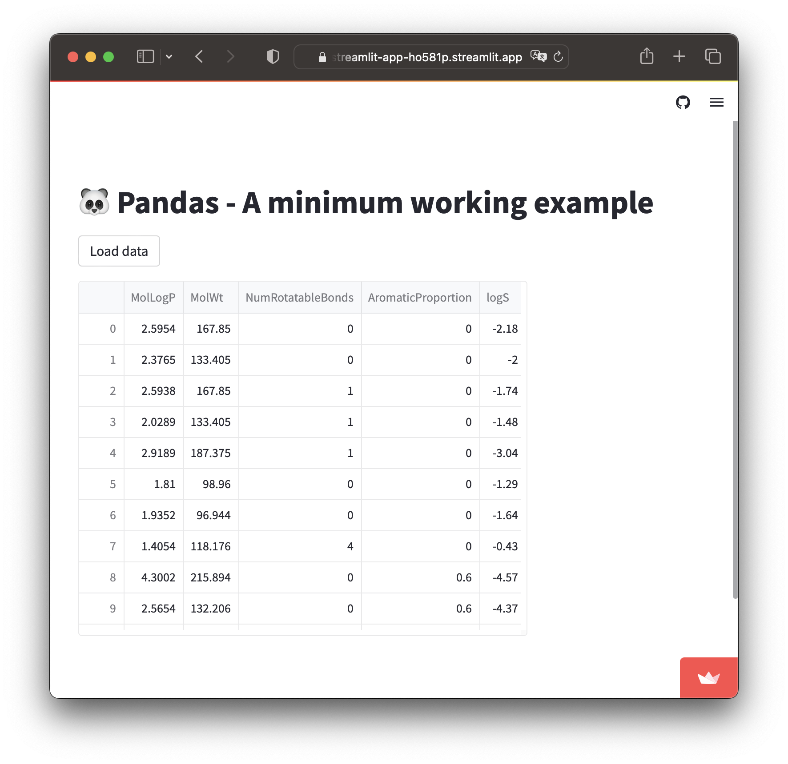

## 🎨 Project 2 - Using Pandas in Streamlit

### What are we building?
Let's now proceed to using Pandas in a Streamlit app. Particularly, we're going to create an app that allows the loading of a CSV data upon clicking on a button.

### How the code works?
Here's an explanation of the code in a step-by-step manner:
1. Import necessary libraries
2. Display the title of the app
3. Create a conditional button that displays a Pandas DataFrame upon clicking on the `Load data` button

### Code
```Python
import streamlit as st
import pandas as pd

st.title('🐼 Pandas - A minimum working example')

if st.button('Load data'):
  df = pd.read_csv('https://raw.githubusercontent.com/dataprofessor/data/master/delaney_solubility_with_descriptors.csv')
  st.write(df)
else:
  st.info('👆 Click on the button ')
```

### Completed app
The above code gives us the following Streamlit app ([GitHub repo](https://github.com/dataprofessor/st-pandas-example-1) | [Demo app](https://dataprofessor-st-pandas-example-1-streamlit-app-ho581p.streamlit.app/))

<p align="left">
  
</p>

### Homework
Now that you have this Pandas app completed, can you build upon this Streamlit app by adding input widgets for taking in user provided URL to a CSV file that can be used for displaying the CSV file as a DataFrame.

> 📣 **Learn in Public:** 
> 
> Share your solution (the updated Streamlit app) on social media (Twitter and/or LinkedIn) and tag us (`@streamlit`).
