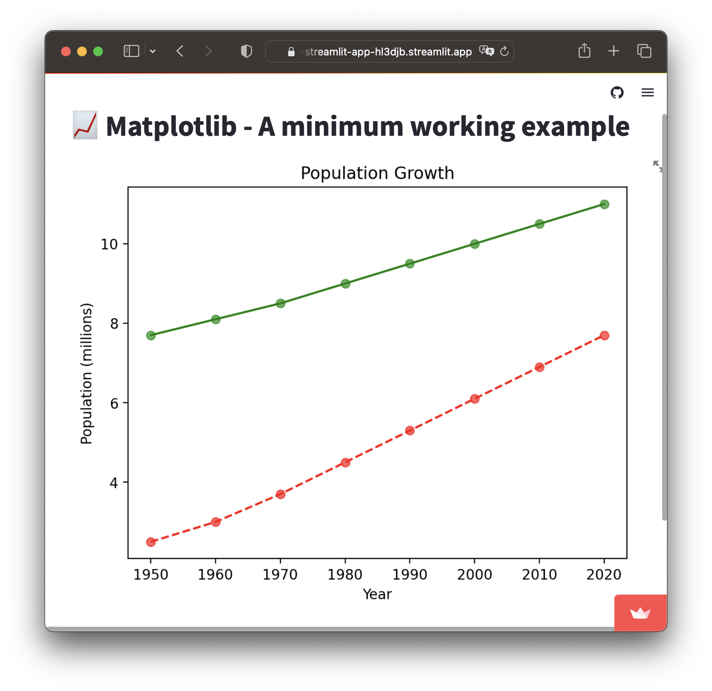

## 🎨 Project 4 - Using Matplotlib to create a plot in Streamlit

### What are we building?

Let's now use Matplotlib to create a plot in a Streamlit app.

### How the code works?
Here's an explanation of the code in a step-by-step manner:
  1. Import the `matplotlib.pyplot` as `plt` (so that we can later refer to `matplotlib.pyplot` literally as `plt` instead of having to type the full version of `matplotlib.pyplot`. **New line of code:** Likewise, we import the Streamlit library using `import streamlit as st`. 
  2. Write out the title of the app via `st.title()`.
  3. Create `years` and `population` variables that will be used for subsequent steps in creating the plot.
  4. Define `fig` and `ax` via `fig, ax = plt.subplots()`, which will be used in `ax.plot()` and `ax.scatter` as well as `st.pyplot(fig)`.
  5. Create the plot via `ax.plot()` and specifying `years` and `population` as input arguments. This will create a line plot.  
  6. The line is changed to red dashed line via the third argument `r--`.
  7. Data points are added via the `ax.scatter` function.
  8. A second green line with green translucent data points are also added here.
  9. Add labels to the plot as well as the X and Y axes.
  10. Finally, we're going to display the plot via `st.pyplot(fig)` (recall the `fig` variable that we defined earlier).
 
### Code
```python
import streamlit as st
import matplotlib.pyplot as plt

st.title('📈 Line plot with Matplotlib')

# Data
years = [1950, 1960, 1970, 1980, 1990, 2000, 2010, 2020]
population = [2.5, 3.0, 3.7, 4.5, 5.3, 6.1, 6.9, 7.7]
population2 = [7.7, 8.1, 8.5, 9.0, 9.5, 10.0, 10.5, 11.0]

# Create plot
# Here we define fig and ax and subsequently replace plt by ax for the plots
fig, ax = plt.subplots()

ax.plot(years, population, 'r--')
ax.scatter(years, population, c='r', alpha=0.6)

ax.plot(years, population2, 'g')
ax.scatter(years, population2, c='g', alpha=0.6)

# Add labels
plt.title('Population Growth')
plt.xlabel('Year')
plt.ylabel('Population (millions)')

# Show plot
# Instead of plt.show() we're using st.pyplot
st.pyplot(fig)
```

### Completed app

The above code gives us the following Streamlit app ([GitHub repo](https://github.com/dataprofessor/st-matplotlib-example) | [Demo app](https://dataprofessor-st-matplotlib-line-plot-streamlit-app-2a0abu.streamlit.app/))

<p align="left">
  
</p>

### Homework
Now that you have this Matplotlib app completed, can you build upon this Streamlit app by adding input widgets for allowing users to choose a line color or data point color of their choice. After selection, the app will update and generate the corresponding plot with the specified colors.

> 📣 **Learn in Public:** 
> 
> Share your solution (the updated Streamlit app) on social media (Twitter and/or LinkedIn) and tag us (`@streamlit`).
