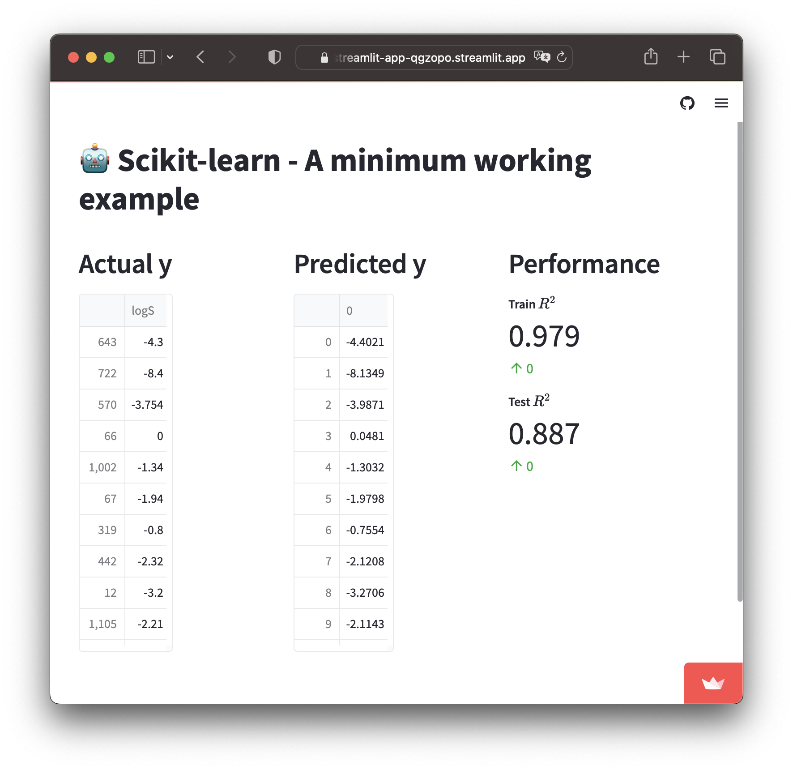

## Project 5 - Using Scikit-learn to create an ML model in Streamlit

### What are we building?
Let's now put together all what we have been covering in this lesson to build an ML model in a Streamlit app.

### How the code works?
Here's an explanation of the code in a step-by-step manner:
1. Import necessary libraries
2. Create custom functions for `load_data`, `preprocess_data`, `model_building` and `model_performance`
3. Use the created functions to carry out the data loading and model building
4. Write out the actual and predicted y data as well as the model performance metrics using Streamlit's `st.write()` and `st.metric()` methods, respectively

### Code
```Python
import streamlit as st
import pandas as pd
from sklearn.model_selection import train_test_split
from sklearn.ensemble import RandomForestRegressor
from sklearn.metrics import mean_squared_error, r2_score

@st.cache_data
def load_data():
  df = pd.read_csv('https://raw.githubusercontent.com/dataprofessor/data/master/delaney_solubility_with_descriptors.csv')
  # Separate data as X and y
  X = df.drop('logS', axis=1)
  y = df['logS']
  return X, y

# Preprocess data
@st.cache_data
def preprocess_data():
  # Data splitting
  X_train, X_test, y_train, y_test = train_test_split(X, y, test_size=0.2, random_state=42)
  return X_train, X_test, y_train, y_test

@st.cache_data
def model_building():
  # Model building
  rf = RandomForestRegressor(max_features=4, n_estimators=100)
  rf.fit(X_train, y_train)
  # Apply trained model to make predictions
  y_train_pred = rf.predict(X_train)
  y_test_pred = rf.predict(X_test)
  return y_train_pred, y_test_pred

@st.cache_data
def model_performance():
  # Evaluate model performance
  train_r2 = r2_score(y_train, y_train_pred)
  test_r2 = r2_score(y_test, y_test_pred)
  train_mse = mean_squared_error(y_train, y_train_pred)
  test_mse = mean_squared_error(y_test, y_test_pred)
  return train_r2, test_r2, train_mse, test_mse

X, y = load_data()
X_train, X_test, y_train, y_test = preprocess_data()
y_train_pred, y_test_pred = model_building()
train_r2, test_r2, train_mse, test_mse = model_performance()

st.title('🤖 Scikit-learn - A minimum working example')

col1, col2, col3 = st.columns(3)

with col1:
  st.header('Actual y')
  st.write(y_train)

with col2:
  st.header('Predicted y')
  st.write(y_train_pred)

with col3:
  st.header('Performance')
  st.metric(label="**Train $R^2$**", value=round(train_r2, 3), delta="0")
  st.metric(label="**Test $R^2$**", value=round(test_r2, 3), delta="0")
```

### Completed app

The resulting Streamlit app ([GitHub repo](https://github.com/dataprofessor/st-scikit-learn-example) | [Demo app](https://dataprofessor-st-scikit-learn-example-streamlit-app-qgzopo.streamlit.app/)) looks like the following:

<p align="left">
  
</p>

### Bonus steps
Now that you have this Scikit-learn app completed, can you build upon this Streamlit app by adding input widgets that will allow users to adjust machine learning parameters. After selection, the app will update and generate a new model with corresponding performance metric values.

==Share your solution (the updated Streamlit app) on social media (Twitter and/or LinkedIn) and tag us (`@streamlit`).==
