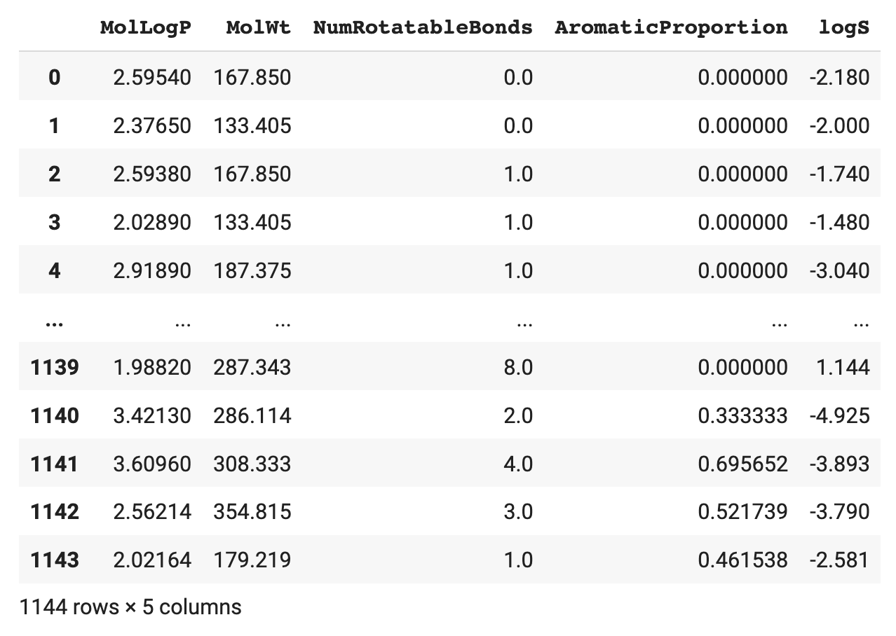

# 📓 Lesson 2 - Getting up to speed with Data Science

## Table of Contents
1. [What is Data Science?](#1-what-is-data-science)
2. [Hardware for Data Science](#2-hardware-for-data-science)
3. [Toolkits for Data Science](#3-toolkits-for-data-science)
4. [NumPy](#3-numpy)
5. [Pandas](#4-pandas)

## 1. What is Data Science?

Data science boils down to the conversion of data to knowledge and insights. At a high-level, the science of data science implies that we're appying the scientific methodology to tackle data problems that essentially starts with the formulation of a working hypothesis or initial assumptions that you have. From there, you can decide which particular data to collect and perform the analysis.

This involves a series of steps and the typical data science process can best be summarized by data frameworks such as [OSEMN](https://web.archive.org/web/20211219192027/http://www.dataists.com/2010/09/a-taxonomy-of-data-science/) that encompasses the following steps involving data:
- **Obtain** - Any data projects essentially starts with access to data and one can do this by compiling a dataset based on objectives of projects.
- **Scrub** - Raw data is often messy, pre-mature and not suitable for data analysis. As a result, one must first pre-process the data such that any missing data and inconsistencies are addressed so that they are amenable for further analysis.
- **Explore** - In order to discover any meaningful insights from the data, exploring the data is often a great first step to gain an understanding of the data. This will allow the practitioner to make a well-informed decision on the next steps for further data exploration or which subset of data to used for further analysis. In some circumstances, one may discover that additional data needs to be collected.
- **Model** - Once data has been prepared and curated, the typical next steps would be to take the data and build a machine learning model that can be used to make predictions on new data.
- **iNterpret** - Probably the most impactful part is the intrepretation of the model where useful knowledge and insights are extracted from models. It should be noted that the most sophisticated machine learning algorithm may not be the best algorithm as they may not afford interpretability whereas simple algorithms such as linear regression or decision tree may provide more interpretability.

Taking a step back for a high-level overview of a typical data project gives us the following summary:

<br>
  <p align="center">
    
  </p>
<br>
  
## 2. Hardware for Data Science

Fundamentally, any hardware that you have access to will be sufficient for the purpose of writing code, perform analysis and testing the creation of Streamlit apps. This can be a laptop, desktop or a computer hosted on the cloud. Such computers could run on a variety of operating systems including Windows, Mac OSX or Linux.

On top of these hardware, just make sure to have a working [Python](https://www.python.org/) environment and we're good to go.


## 3. Toolkits for Data Science

Now that we have a fundamental knowledge of data science and the hardware, let's take a look at the tools of the trade.

Common toolkits that are helpful for any data science projects includes the following:
Python library | Brief description | OSEMN phase
---|---|---
`NumPy` | Numerical processing | Scrub
`Pandas` | Data wrangling | Scrub
`Matplotlib` | Data visualization | Explore
`Seaborn` | Data visualization | Explore
`Plotly` | Data visualization | Explore
`Altair` | Data visualization | Explore
`Scikit-learn` | Machine learning | Model / iNterpret

These toolkits provide ready-to-use functions that can be readily harnessed to retrieve, prepare, visualize and analyze data. Without such toolkits we would have to implement our own custom functions to do the same tasks.

## 4. NumPy

NumPy is a Python library that allows you to perform numerical processing. 

Here are some of the following features that NumPy can do:
- Supports N-dimensional array and matrix data structures
- Perform various mathematical operations on arrays and matrices
- Transposing and reshaping matrices
- Random number generation
- etc.

### 4.1. Installing NumPy

Let's start by installing NumPy that can be performed as follows:

```
pip install numpy
```

### 4.2. Using NumPy

To start using Numpy, we can import NumPy as follows:
```Python
import numpy as np
```

Let's consider a simple use case of NumPy for creating various data structures particularly tensors. Particularly, we'll use the `np.array()` method to create scalar, vector, matrix and a 3D tensor:
```Python
# Create a scalar (0D Tensor)
x1 = np.array(0)

# Create a vector (1D Tensor)
x2 = np.array([0, 1, 2])

# Create a matrix (2D Tensor)
x3 = np.array([0, 1, 2], [3, 4, 5], [6, 7, 8])

# Create a 3D Tensor
x4 = np.array([[[ 0,  1,  2],[ 3,  4,  5],[ 6,  7,  8]],
               [[ 9, 10, 11],[12, 13, 14],[15, 16, 17]],
               [[18, 19, 20],[21, 22, 23],[24, 25, 26]]])
```

<p align="center">
  
</p>

As summarized above, a vector is an array of scalar, a matrix is an array of vectors and the 3D tensor is an array of matrix.

Now that we have taken a quick glance at NumPy, let's proceed to seeing how we can handle and process data.

## 5. Pandas

Pandas is a Python library that allows the loading, processing and wrangling of data. With Pandas you can gain access to data from a multitude of input sources such as CSV, TSV, Excel, SQL databases, JSON, etc. Afterwards, data can be exported out in the aforementioned formats as well.

### 5.1. Installing Pandas

Let's start by installing Pandas that can be performed as follows:

```
pip install pandas
```

### 5.2. Using Pandas

To start using Pandas, we can import Pandas as follows:
```Python
import pandas as pd
```

Let's consider a simple use case of Pandas that I use quite often, which is to read in a CSV data:

```Python
df = pd.read_csv('data.csv')
```

In the above example, we are reading from a local file. However, if the CSV file is located on the cloud, it could also be read in a similar fashion. So instead of the file name, you can paste in the URL of the CSV file:

```Python
df = pd.read_csv('https://raw.githubusercontent.com/dataprofessor/data/master/delaney_solubility_with_descriptors.csv')
```

To display the CSV data, this is as simple as calling the `df` variable:

```Python
df
```

which should yield the following DataFrame:

<p align="center">
  
</p>

The DataFrame could be thought of as having an $m×n$ matrix with $m$ rows and $n$ columns.
