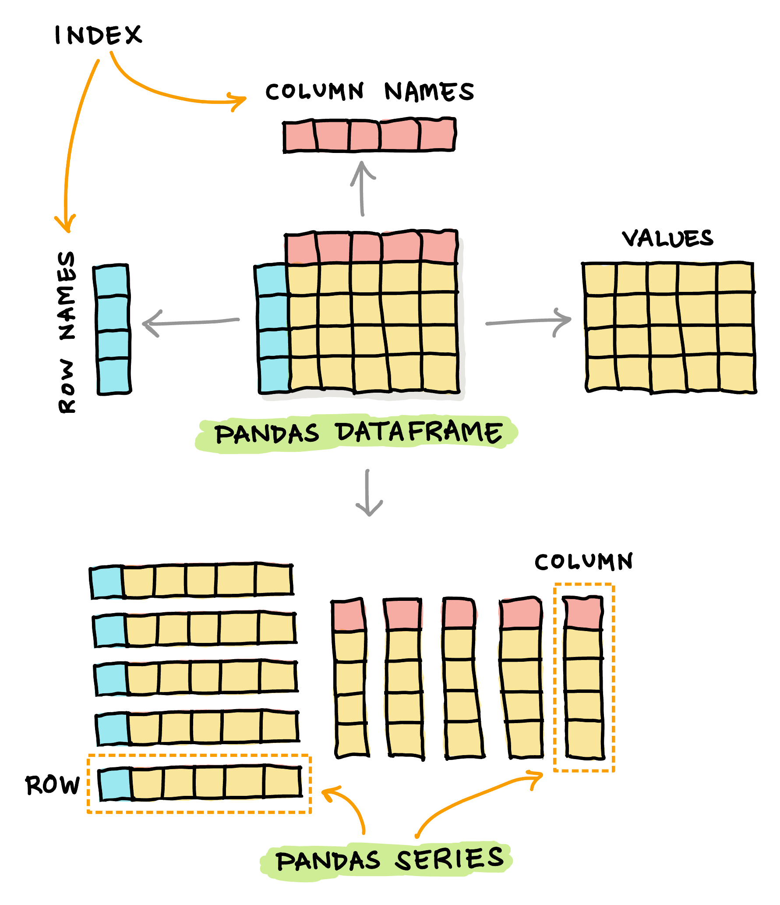
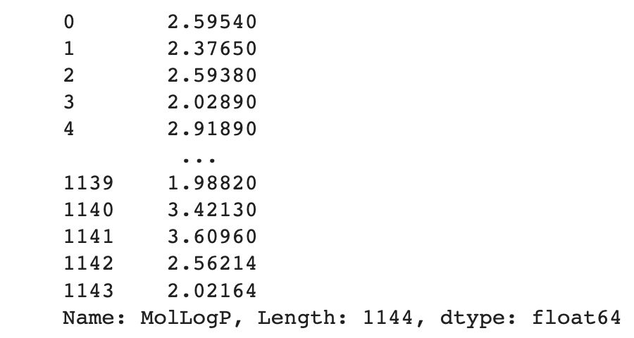
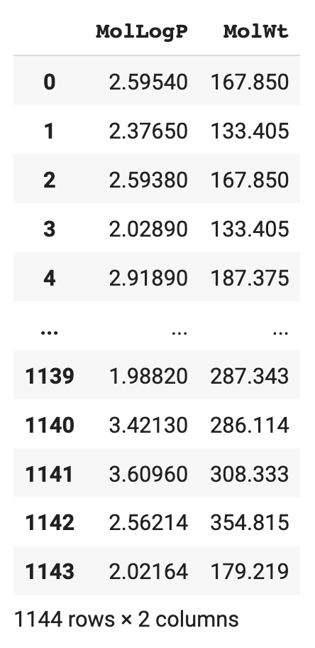

# 📓 Lesson 4 - Data wrangling with Pandas

Pandas is a Python library that allows the loading, processing and wrangling of data. With Pandas you can gain access to data from a multitude of input sources such as CSV, TSV, Excel, SQL databases, JSON, etc. Afterwards, data can be exported out in the aforementioned formats as well.

## Installing Pandas

Let's start by installing Pandas that can be performed as follows:

```
pip install pandas
```

## Using Pandas

To start using Pandas, we can import Pandas as follows:
```Python
import pandas as pd
```

## Pandas Data Structure

Pandas allow us to work with tabular datasets. Let us take a look at the basic data structures of Pandas that consists of 3 types as follows (i.e. the first two are the data structures while the latter serves as a point of reference):

1. Series
2. DataFrame
3. Index

In a nutshell, you will see that a ***Pandas DataFrame*** and ***Pandas Series*** are labeled data (i.e. it has row names and column names). 

You’ll also see that a ***Pandas DataFrame*** is a collection of Pandas Series (i.e. the individual columns and rows).

### Pandas Series

A ***Pandas Series*** is a one-dimensional array that is very much similar to the NumPy array but with the ability to be labeled (i.e. the axis label or also called the index). A Series can hold an integer, float, string, python object, etc. At a high-level, a Series can be thought of as a column in Microsoft Excel.

### Pandas DataFrame

A ***Pandas DataFrame*** is a two-dimensional array. At a high-level, a DataFrame can be thought of as the spreadsheet in Microsoft Excel (i.e. a M × N matrix where M denotes the rows and N the columns).

### Pandas Index

The ***index*** in Pandas is an inherent property of Series and DataFrame objects that serves as a point of reference as to which rows and/or columns to perform operations on (i.e. for a DataFrame) or the specific element in a Series to perform operations on. By default, Pandas automatically assigns index numbers starting from 0 to denote the row numbers or column numbers (i.e. if none are explicitly defined).


## Read CSV data

Let's consider a simple use case of Pandas that I use quite often, which is to read in a CSV data:

```Python
df = pd.read_csv('data.csv')
```

In the above example, we are reading from a local file. However, if the CSV file is located on the cloud, it could also be read in a similar fashion. So instead of the file name, you can paste in the URL of the CSV file:

```Python
df = pd.read_csv('https://raw.githubusercontent.com/dataprofessor/data/master/delaney_solubility_with_descriptors.csv')
```

To display the CSV data, this is as simple as calling the `df` variable:

```Python
df
```

which should yield the following DataFrame:

<p align="left">
  
</p>

As we can see, the DataFrame could be thought of as an $m×n$ matrix with $m$ rows and $n$ columns.

## Selecting a single column

To select specific columns (such as the *MolWt* column) we can run the following:
```Python
df['MolLogP']
```
which produces the following Series output:
<p align="left">
  
</p>

## Selecting multiple columns

To select multiple columns (such as *MolWt* and *MolWt*) we can run the following:
```Python
df[['MolLogP','MolWt']]
```
which produces the following DataFrame output:
<p align="left">
  
</p>
