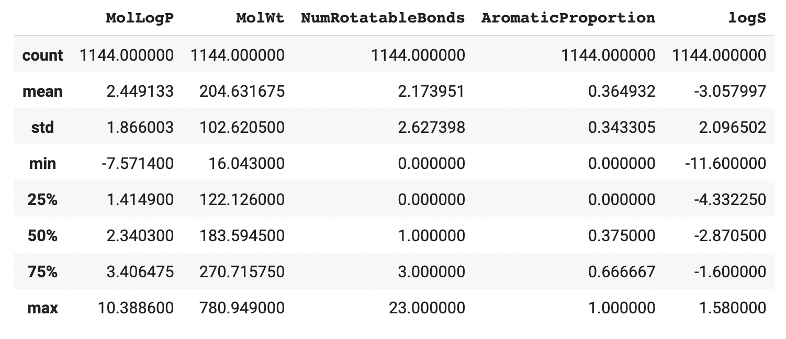

# 📓 Lesson 5 - Exploratory Data Analysis with Pandas

<p align="center">
  
</p>

In the previous lesson, we've explored how Pandas can be used to perform data wrangling and in this lesson we're going to take this a step further and take a look at how we can also use Pandas to explore the data.

Thus, we're going to perform preliminary statistical analysis and generate simple visualizations of the data purely in Pandas without the need to use any external libraries.

## Summary Statistics

### Descriptive Statistics

The `describe()` function allows you to quickly compute descriptive statistics.

<p align="left">
  
</p>

### Value Counts

To examine the distribution of values for any given column we can use the `value_counts()` function.

```Python
df.NumRotatableBonds.value_counts()
```
```
0.0     362
1.0     239
2.0     178
3.0     103
4.0      88
5.0      58
6.0      40
8.0      24
7.0      22
9.0       9
10.0      6
12.0      4
14.0      3
16.0      2
13.0      2
15.0      1
17.0      1
23.0      1
11.0      1
Name: NumRotatableBonds, dtype: int64
```
